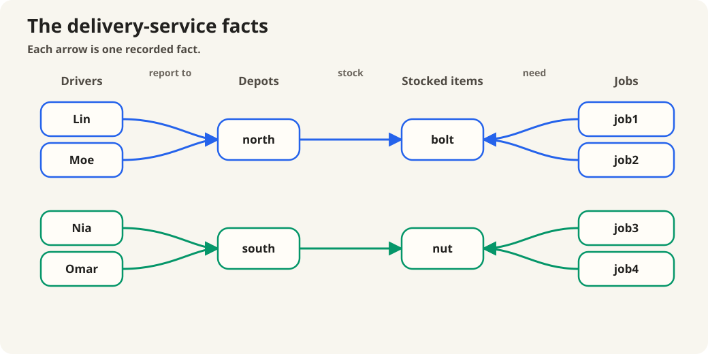

# The order logic did not choose

:::ada
Before choosing an algebraic tree, consider a delivery service. These are its
recorded facts:



A driver is eligible for a job when the driver's depot stocks the item that the
job needs. Is Lin eligible for `job1`?
:::alice
Yes. Lin reports to `north`, `north` stocks `bolt`, and `job1` needs `bolt`.
Those three facts connect Lin to `job1`.
:::

:::ada
Is Lin eligible for `job3`?
:::alice
No. `job3` needs `nut`, but Lin's depot stocks `bolt`.
:::

:::ada
Now find every eligible driver–job pair. If you begin with the drivers, how
would you organize the reasoning?
:::alice
For each driver, find the driver's depot, then the item stocked there, and
finally the jobs needing that item. Lin and Moe reach `job1` and `job2` through
`north` and `bolt`; Nia and Omar reach `job3` and `job4` through `south` and
`nut`.
:::

:::ada
How would you organize the reasoning starting from the jobs?
:::alice
For each job, find its required item, then the depot stocking that item,
and finally the drivers based at that depot. The reasoning runs in the opposite
direction but produces the same eight driver–job pairs.
:::

:::ada
Consider a third correct method: first pair every driver with every job, and
only afterward check whether the driver's depot stocks the required item. How
many pairs exist before that check?
:::alice
There are four drivers and four jobs, so it begins with sixteen pairs. Eight
survive after the depot and item facts are checked.
:::

:::ada
Write the eligibility condition as a conjunctive query.
:::alice
```text
eligible(driver, job) :-
    based_at(driver, depot),
    stocks(depot, item),
    needs(job, item).
```
:::

:::ada
Let \(D,S,N\) be the local atom relations for `based_at`, `stocks`, and
`needs`. Their schemas are

```text
D = {driver, depot}
S = {depot, item}
N = {job, item}.
```

Before choosing either direction, write the complete body meaning and the query
result.
:::alice
The body meaning is the flat join

$$
D\bowtie S\bowtie N.
$$

The query result is

$$
\pi_{driver,job}(D\bowtie S\bowtie N).
$$

The flat join says that all three atom relations must agree. It does not say
which pair is joined first.
:::

:::definition Flat project-join query and binary interpretation
A **flat project-join query** has the form

$$
\pi_H(E_1\bowtie\cdots\bowtie E_n),
$$

where \(H\) is the output schema and each \(E_i\) is an atom relation. The
polyadic join denotes one relation without choosing a binary evaluation order.
A **binary join-expression tree** is one parenthesized interpretation of that
join. Associativity and commutativity license multiple equivalent trees.
:::

:::reading
**Book form and course application.** Abiteboul, Hull, and Vianu,
*Foundations of Databases*, Chapter 4, §4.4, p. 58, states that natural join is
associative and commutative and may be viewed as a polyadic operator. Chapter
6, §6.4, p. 126, studies flat project-join queries of the form
\(\pi_X(R_1\bowtie\cdots\bowtie R_n)\). Applying that form to renamed CQ atom
relations is the course application above.
:::

:::ada
Now translate the driver-first reasoning. Begin with \(D\bowtie S\). What rows
and columns does that first join produce?
:::alice
It produces four rows:

```text
driver  depot  item
Lin     north  bolt
Moe     north  bolt
Nia     south  nut
Omar    south  nut
```

The two input schemas share `depot`, so the result has the three-column schema
`{driver,depot,item}` rather than four columns. The complete body tree is

$$
(D\bowtie S)\bowtie N.
$$

The second join shares `item`, adds `job`, and produces eight rows over four
columns. The join-output row counts are `4, 8`.
:::

:::law Schema and logical arity of natural join
If relation instances over schemas \(R\) and \(S\) are naturally joined, the
result has schema \(R\cup S\). Therefore its number of columns is

$$
|R\cup S|=|R|+|S|-|R\cap S|.
$$

In this course, \(|R|\) is the relation's **logical arity**: its number of named
columns. It is not the tuple's byte width in a physical representation.
:::

:::reading
**Book law; course terminology.** Abiteboul, Hull, and Vianu, *Foundations of
Databases*, Chapter 4, §4.4, pp. 57–58, defines natural join with output sort
\(R\cup S\) and identifies Cartesian product as the disjoint-sort case.
**Logical arity** is the course name used here for the number of attributes in
that sort.
:::

:::ada
Now follow the job-first reasoning. What does \(S\bowtie N\) produce before it
meets \(D\)?
:::alice
It produces four `(depot, item, job)` rows. The schemas share `item`, so it also
has three columns. The complete tree is

$$
D\bowtie(S\bowtie N).
$$

The second join shares `depot`, adds `driver`, and produces eight rows over four
columns. Its join-output row counts are again `4, 8`.
:::

:::ada
Before translating the third method, which shared variable could the natural
join of \(D\) and \(N\) require agreement on?
:::alice
None. \(D\) contains `{driver,depot}`, while \(N\) contains `{job,item}`. The
`stocks` atom \(S\) is the only atom connecting `depot` to `item`.
:::

:::ada
With no shared variable, what does \(D\bowtie N\) produce? Include both rows
and columns.
:::alice
It is the Cartesian product \(D\times N\). Every one of the four \(D\) rows
combines with every one of the four \(N\) rows, so it has sixteen rows. The two
schemas are disjoint, so their union has four columns.
:::

:::ada
Now write the complete expression.
:::alice
It is

$$
(D\times N)\bowtie S.
$$

The final join removes the unsupported pairs and leaves the same eight complete
valuations. Since both columns of \(S\) are already present, the result remains
four columns wide. Its join-output row counts are `16, 8`.
:::

:::ada
What information did those extra product rows lack?
:::alice
They had a driver, that driver's depot, a job, and that job's item, but no fact
yet established that the depot stocked the item. The product carried all
sixteen possibilities until `stocks` could reject eight of them.
:::

:::ada
The output of a nonfinal expression is called an **intermediate relation**.
After the common head projection, all three body-join trees return the same
eight answers. Why should we care that one tree first produced sixteen rows?
:::alice
Because the final join must receive and check all sixteen candidates against
`stocks`. Eight were constructed and carried forward only to be rejected.

In \((D\bowtie S)\bowtie N\), `stocks` is checked earlier. Only four supported
`(driver,depot,item)` rows reach the final join, which extends them into eight
complete valuations.
:::

:::definition Intermediate relation
The relation denoted by a nonfinal expression-tree node is an **intermediate
relation**. Its existence in the logical expression does not require a physical
implementation to materialize it.
:::

:::reading
**Book terminology.** Abiteboul, Hull, and Vianu, *Foundations of Databases*,
Chapter 6, §6.1, pp. 109–110, treats the outputs of internal expression-tree
nodes as intermediate results or intermediate relations.
:::

:::ada
Three atoms let us change the first pair. Four atoms also let us change the
shape of the binary tree. For

```text
hub_visit(from, to) :-
    road(from, hub),
    open(hub, day),
    rail(hub, to),
    staffed(hub, worker).
```

write \(R,O,T,F\) for the atom relations. Compare

$$
(((R\bowtie O)\bowtie T)\bowtie F)
$$

with

$$
(R\bowtie O)\bowtie(T\bowtie F).
$$

How are the two tree shapes different?
:::alice
The first repeatedly joins one accumulated result with one untouched atom. It
is left-deep. The second builds \(R\bowtie O\) and \(T\bowtie F\) separately,
then joins those two intermediate relations. It is bushy.

Those names describe shape only. They do not tell us which tree is cheaper.
:::

:::definition Left-deep and bushy binary join expressions
A binary join-expression tree is **left-deep** when every right child of a join
node is an atom-expression leaf. It is **bushy** when some join node has two
non-leaf children. These terms describe operator-tree shape; they do not state
which tree is cheaper.
:::

:::reading
**Course terminology; book basis.** Abiteboul, Hull, and Vianu,
*Foundations of Databases*, Chapter 6, §6.1, pp. 112–114, discusses System R's
left-to-right join orderings. Exercise 6.5, p. 137, asks for evaluation by an
arbitrary binary tree. **Left-deep** and **bushy** are the course terms used to
contrast those shapes.
:::

:::ada
Tree shape alone does not rank plans, but our `eligible` example exposed one
measurable difference: the rows produced at internal combine nodes. How could we
turn that observation into a deliberately limited comparison?
:::alice
Sum the row cardinalities emitted by the natural-join and Cartesian-product
nodes. Do not include relation leaves or the final head projection.

That would compare visible logical row volume without pretending to estimate
physical runtime.
:::

:::definition Logical row-volume proxy (course approximation)
For a logical body-join plan \(P\) and input instance \(I\), let
\(\operatorname{CombineNodes}(P)\) contain its natural-join and Cartesian-
product expression nodes, and define

$$
W_0(P,I)=
\sum_{M\in\operatorname{CombineNodes}(P)}
|[\![M]\!]_I|.
$$

This proxy counts rows produced by binary combine nodes. It excludes relation
leaves, projections, logical arity, byte width, access paths, and physical
operator costs.
:::

:::reading
**Course approximation; book basis.** Abiteboul, Hull, and Vianu,
*Foundations of Databases*, Chapter 6, §6.1, pp. 109–111, compares plans using
intermediate sizes and other physical factors. The formula \(W_0\) is a course
proxy derived from that motivation; it is not a formula stated in the book.
:::

:::ada
Compute the proxy for the three plans.
:::alice
The two shared-variable plans each give

$$
W_0=4+8=12,
$$

while the Cartesian-first plan gives

$$
W_0=16+8=24.
$$

The proxy sees the extra rows. It does not see that the first connected
intermediate has three columns while the Cartesian one has four.
:::

:::ada
Abiteboul, Hull, and Vianu also compare intermediate tuples by byte width,
tuples per page, and pages occupied. Explain what additional information is
needed to move from a count of three or four logical columns to those physical
quantities.
:::alice
Logical arity counts named columns. Physical tuple width also depends on types,
encodings, and layout. Page use depends on that width, row cardinality, and the
operator's representation.

Thus row cardinality, logical arity, and physical width are three different
measurements. \(W_0\) records only the first.
:::

:::notice Logical arity is not physical tuple width
Logical arity counts named columns. Physical width depends on types, encodings,
and layout. Page traffic also depends on how operators are implemented. Row
count and logical arity expose useful structure, but neither is a runtime cost
model.
:::

:::reading
**Book cost dimensions.** Abiteboul, Hull, and Vianu, *Foundations of
Databases*, Chapter 6, §6.1, pp. 109–110, compares equivalent query trees using
tuple counts, tuple width, tuples per page, and pages occupied by intermediate
relations.
:::

:::ada
Return to `eligible`, but change only its input instance. Suppose \(D\), \(S\),
and \(N\) each contain three rows. Both possible first joins share a variable
and add one column. Must their first outputs therefore have the same row
cardinality?
:::alice
Not from that information alone. Equal input cardinalities and equal output
arities do not say how often the shared values match. I need to see the rows.
:::

:::ada
Here is the instance:

```text
based_at               stocks              needs
(Lin, north)            (north, bolt)       (job1, bolt)
(Moe, north)            (north, screw)      (job2, bolt)
(Nia, south)            (south, nut)        (job3, nut)
```

Trace `D` joined with `S` one shared `depot` value at a time.
:::alice
For `north`, two drivers agree with two stocked items, producing four tuples.
For `south`, one driver agrees with one stocked item, producing one more. Thus
`D` joined with `S` produces five tuples:

```text
(Lin, north, bolt)
(Lin, north, screw)
(Moe, north, bolt)
(Moe, north, screw)
(Nia, south, nut)
```
:::

:::ada
Now trace `S` joined with `N` by `item`.
:::alice
`bolt` produces two tuples, `screw` produces none, and `nut` produces one. Thus
`S` joined with `N` produces three tuples:

```text
(north, bolt, job1)
(north, bolt, job2)
(south, nut, job3)
```
:::

:::ada
After the common head projection, both body-join trees return five driver–job
pairs. Compare their logical row volumes.
:::alice
The driver-first plan has join-output sizes `5, 5`, so \(W_0=10\). The job-first
plan has sizes `3, 5`, so \(W_0=8\).

All three input relations had cardinality three, but the first joins had
cardinalities five and three. Join cardinality depends on how many tuples agree
at each shared value, not only on the input relation sizes.
:::

:::ada
Compare the two `eligible` instances. What could we determine from the query
schemas alone, and what required the relation rows?
:::alice
The schemas determine which joins share variables, whether a first join is
Cartesian, and the raw columns produced by each join. The relation rows
determine how many compatible pairs exist.

That is why the same two first-join schemas produced cardinalities `4, 4` on one
instance and `5, 3` on the other.
:::

:::ada
The next planning tool should preserve exactly that structural information. It
should show which variables occur together in each atom, but it should not claim
to know cardinalities or choose a binary tree. Sketch `eligible` using only
that information.
:::alice
I would place `driver`, `depot`, `item`, and `job` as points, then draw one
connection for each atom occurrence. The three binary atoms form a path:
`driver`—`depot`—`item`—`job`.

That works for `eligible`. I do not yet know whether an ordinary two-ended edge
can preserve one atom that constrains three variables at once.
:::

:::recap The flat join and its binary shapes
The flat expression

$$
\pi_{driver,job}(D\bowtie S\bowtie N)
$$

states the query meaning without choosing an order. A binary join-expression
tree supplies one parenthesized interpretation. With four or more atoms, such a
tree may be left-deep or bushy.

Natural join produces the union of its input schemas. Two two-column inputs
therefore produce three columns when they share one name and four when they are
disjoint. This logical arity is separate from row cardinality and from physical
tuple width.

On the first `eligible` instance, the two connected plans have join-output row
counts `4, 8`, while the Cartesian-first plan has `16, 8`. Their logical row
volumes are \(12\), \(12\), and \(24\). On the second instance, equal-size
inputs and equal three-column outputs still produce first-join cardinalities
five and three because shared values occur with different frequencies.

The query text exposes schema overlap and raw arity. Data determines join
cardinality. \(W_0\) counts only rows emitted by combine nodes; it is not a
physical cost model. Conversation 2.2 develops the structural picture suggested
by those limits.
:::
