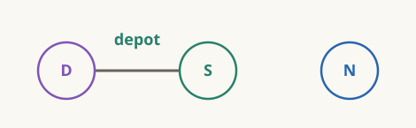
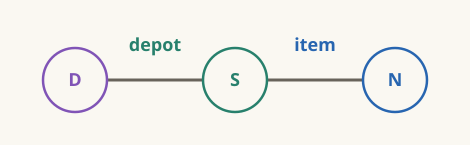
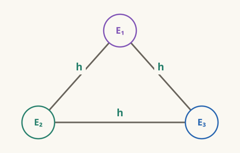
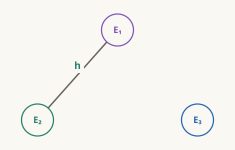
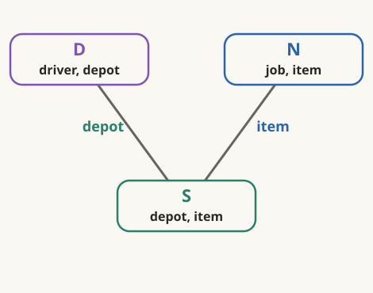

# The picture that did not choose

:::ada
Representing dependencies as a graph is a common technique in computer
science. Let us use it to record the connections we found in 2.1:

```text
eligible(driver, job) :-
    based_at(driver, depot),
    stocks(depot, item),
    needs(job, item).
```

We will give each body occurrence a vertex. Call these three $D$, $S$,
and $N$. The head tells us what to return; it adds no body constraint,
so it gets no vertex here.
:::alice
Here are the vertices.


I want to know which two to join first. Is that what the edges will tell me?
:::

:::ada
Let us first draw the agreements required by the rule. $D$ and $S$ share
`depot`, so connect their vertices and label the edge with the variable
their tuples must agree on.


:::alice
Then I can add the `item` edge between $S$ and $N$.



There is no variable to put on an edge from $D$ to $N$. That was our
Cartesian product.
:::

:::ada
They are connected through $S$, which tests whether the depot stocks
the item.

:::alice
So the missing edge does not forbid me from combining $D$ and $N$ first.
I would just be postponing the stock check, as we did in 2.1.
:::

:::ada
You could. Write the same condition with `needs` before `stocks`:

```text
eligible(driver, job) :-
    based_at(driver, depot),
    needs(job, item),
    stocks(depot, item).
```

Keep the labels $D,S,N$ with their original atoms.
:::alice
Nothing in the picture needs to move.


$D$ and $N$ are next to each other in the rule now, but they still share
no variable. The required agreements have not changed.
:::

:::ada
Nor have the answers. Notice that our edges have no arrows. If $D$ must agree
with $S$ on `depot`, then $S$ must agree with $D$ on `depot`.

That condition is symmetric, so we use an **undirected graph**.
:::alice
So the line does not tell me to go from $D$ to $S$. I can start from
either side and still have to make their depot values agree.
:::

:::definition Undirected graph
An **undirected graph** \(G=(V,E)\) has a finite vertex set \(V\) and an
edge set

$$
E\subseteq\bigl\{\{u,v\}\mid u,v\in V,\ u\ne v\bigr\}.
$$

An edge is an unordered pair: \(\{u,v\}=\{v,u\}\).
:::

:::reading
**Book definition.** Abiteboul, Hull, and Vianu,
[Foundations of Databases, Chapter 2](https://webdam.di.ens.fr/Alice/pdfs/Chapter-2.pdf#page=3),
§2.1, p. 12, gives this unnumbered definition of an undirected graph.
:::

:::ada
Try the same edge rule when all three body occurrences use `road`.
Here are three roads from a common origin:

```text
shared_origin(a, b, c) :-
    road(h, a),
    road(h, b),
    road(h, c).
```

Call these separate uses of `road` $E_1,E_2,E_3$, in written order.
:::alice
$E_1$ and $E_2$ share `h`. So do $E_2$ and $E_3$—and $E_1$ and $E_3$.
I need all three edges.


:::

:::ada
Now replace `h` in just the third atom:

```text
road_choices(a, b, c) :-
    road(h, a),
    road(h, b),
    road(other, c).
```

Which edges would you erase?
:::alice
Both edges touching $E_3$. Its variables are now `other,c`, and neither
occurs in the first two atoms. The edge between $E_1$ and $E_2$ stays.



They all still read `road`, though. The separation comes from how the
query uses it.
:::

:::ada
The third origin might happen to equal `h`, but the query no longer
requires it. Joining $E_3$ with $E_1\bowtie E_2$ is a Cartesian step.

This is the **sideways information-passing (SIP) graph**: one vertex per
relational body occurrence, with an undirected edge between two distinct
vertices exactly when their atoms share a variable.
:::alice
Why is it called “sideways information passing”?
:::

:::ada
Here, “sideways” refers to information passing between atoms in the same
rule body. A match at one atom can narrow what we look for at another.
Think of our delivery query:

```text
eligible(driver, job) :-
    based_at(driver, depot),
    stocks(depot, item),
    needs(job, item).
```

Take `(job1,bolt)` from $N$. Its `item` is already known. What must a
matching stock tuple contain?
:::alice
`bolt` in its `item` column. I can use the value from $N$ to narrow the
stock choices in $S$.


:::

:::definition Sideways information-passing (SIP) graph
Let \(A_1,\ldots,A_m\) be a rule's relational body occurrences, and let
\(X_i=\operatorname{vars}(A_i)\). Its **SIP graph** has one vertex \(v_i\)
for each occurrence, with

$$
\{v_i,v_j\}\in E
\quad\Longleftrightarrow\quad
 i\ne j\ \text{and}\ X_i\cap X_j\ne\varnothing.
$$

A vertex is specially marked when its atom contains a constant. Constraint
atoms, such as comparisons, do not contribute vertices.
:::

:::reading
**Book definition; course notation.** Abiteboul, Hull, and Vianu,
[Foundations of Databases, Chapter 6](https://webdam.di.ens.fr/Alice/pdfs/Chapter-6.pdf#page=9),
§6.1, p. 113, defines the SIP graph in the unnumbered paragraph following
Figure 6.3; p. 112 distinguishes relational and constraint atoms. Our
drawings index occurrences, retain full atom labels, and label edges with
all shared variables. These examples have no constants to mark.
Example 6.1.1, p. 112, motivates passing restrictions between atoms;
the delivery tuples illustrate that idea here.
:::

:::ada
Right. The graph records where that information can pass. How much it
narrows the choices depends on the tuples.

Recall the two orders for `eligible` in 2.1. All three inputs had three
tuples. $D\bowtie S$ produced five, while $S\bowtie N$ produced three.
:::alice
Then those counts were not in the picture. But the two joins check
different variables. How does checking `item` earlier save work in the
join on `depot`?
:::

:::ada
Let us follow one stock tuple. Here are $S$ and $N$ from that instance:

**stocks**

| depot | item |
|---|---|
| north | bolt |
| north | screw |
| south | nut |

**needs**

| job | item |
|---|---|
| job1 | bolt |
| job2 | bolt |
| job3 | nut |

Which stock tuple has no matching job?
:::alice
`(north,screw)`. No job needs a screw.

So `north` is gone?
:::

:::ada
`(north,bolt)` still has matching jobs. What did we actually remove?
:::alice
Just `(north,screw)`, one stock choice at north.
:::

:::ada
Yes. `needs` inspected the item, but rejected the whole stock tuple.
Before that check, which drivers would have matched it?

| driver | depot |
|---|---|
| Lin | north |
| Moe | north |
| Nia | south |
:::alice
Lin and Moe. We would have constructed both of these:

| driver | depot | item |
|---|---|---|
| Lin | north | screw |
| Moe | north | screw |

Removing that stock choice first avoids these two wasted tuples.
:::

:::ada
`stocks` admits particular depot–item pairs. Removing a pair changes the
choices available to the driver join.


The edges record agreement across atoms on the same variable. The
association between the different variables `depot` and `item` is inside
$S$.
:::alice
$D$ never sees `item`, but the item check can still leave it fewer stock
tuples to match. Can we make the connection inside $S$ visible too?
:::
