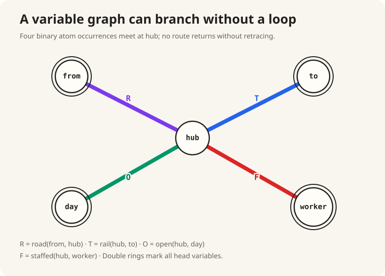
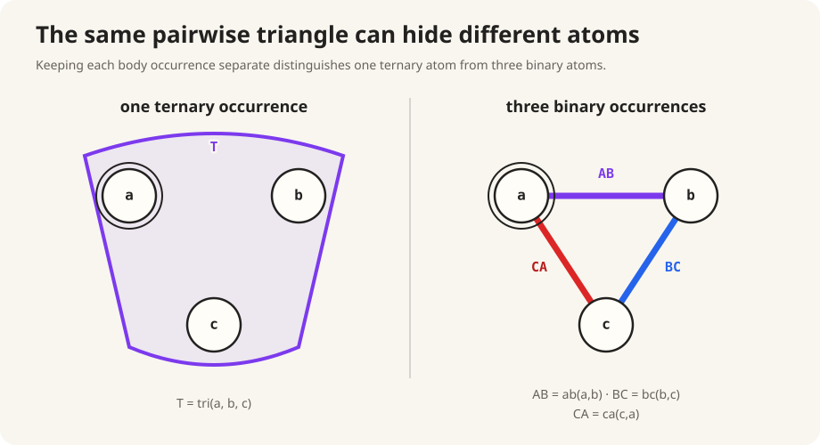

# The picture that did not choose

:::ada
Return to

```text
eligible(driver, job) :-
    based_at(driver, depot),
    stocks(depot, item),
    needs(job, item).
```

Call the three body-atom occurrences \(D,S,N\). Before looking at any rows,
which pairs share a variable?
:::alice
\(D\) and \(S\) share `depot`; \(S\) and \(N\) share `item`; \(D\) and \(N\)
share no variable.
:::

:::ada
Those overlaps belong to the query; the row counts from Conversation 2.1
belonged to particular inputs. Draw a variable-side picture using one vertex
per variable and one labeled edge per binary atom occurrence.
:::alice
The three edges form a path:

$$
driver\mathrel{\mathop{-}^{D}}depot
\mathrel{\mathop{-}^{S}}item
\mathrel{\mathop{-}^{N}}job.
$$


The \(D\) and \(N\) edges do not meet. The \(S\) edge connects them.
:::

:::definition Binary variable graph (course convention)
For a CQ whose indexed body occurrences \(B_1,\ldots,B_n\) each contain exactly
two distinct variables, its **binary variable graph** has

$$
V=\bigcup_{i=1}^{n}\operatorname{vars}(B_i)
$$

as vertices and one predicate-labeled edge
\(e_i=\operatorname{vars}(B_i)\) for each occurrence. Occurrence indexes keep
repeated uses of the same predicate separate. Head variables may be marked on
the vertices without changing the graph.
:::

:::reading
**Course convention; book contrast.** Abiteboul, Hull, and Vianu,
*Foundations of Databases*, Chapter 6, §6.1, pp. 112–113, defines a sideways
information passing graph whose vertices are relational atoms and whose edges
record shared variables. The binary variable graph above reverses that viewpoint
for this course: variables are vertices and binary atom occurrences are labeled
edges.
:::

:::ada
What can this path tell us about the possible first joins, and what remains
invisible without data?
:::alice
It shows that \(D\bowtie S\) and \(S\bowtie N\) check a shared variable, while
\(D\bowtie N\) is Cartesian. It also determines their raw output arities: three,
three, and four columns.

It cannot recover the row counts `4, 4, 16` from the first instance or `5, 3`
from the second. Those depended on stored values.
:::

:::ada
A path is only one possible shape. Draw the binary variable graph of

```text
hub_snapshot(from, to, day, worker) :-
    road(from, hub),
    rail(hub, to),
    open(hub, day),
    staffed(hub, worker).
```
:::alice
Every edge contains `hub`, so the graph is a star.


:::

:::ada
Suppose `road(from,hub)` and `rail(hub,to)` have already joined. Which of their
three variables still has work to do?
:::alice
All three. `from` and `to` occur in the head. `hub` occurs in the two unchosen
spokes. None can disappear yet.
:::

:::ada
Now compare the path

```text
path_answer(a, d) :-
    r(a, b),
    s(b, c),
    t(c, d).
```

After the first two atoms join, which variable has finished its work?
:::alice
`b`. It was needed to connect `r` and `s`, but it occurs neither in the head nor
in the remaining atom. The raw intermediate has `{a,b,c}`, although only `a`
and `c` still lead outside it.
:::

:::ada
A cycle changes the role of the last edge. Begin with

```text
edge(a, b),
edge(b, c).
```

Compare adding `edge(c,d)` with adding `edge(c,a)`. Which one adds a fresh
vertex?
:::alice
`edge(c,d)` adds `d`. In `edge(c,a)`, both variables already occur in the path.
:::

:::ada
Then in

```text
on_triangle(a) :-
    edge(a, b),
    edge(b, c),
    edge(c, a).
```

what can the third occurrence do after the first two have introduced `a`, `b`,
and `c`?
:::alice
It introduces no variable. It only checks whether the existing values of `c`
and `a` satisfy `edge(c,a)`.


A ternary atom could also be drawn as a triangle of pairwise lines, but I am not
sure that picture would mean the same thing.
:::

:::ada
Test it on this four-row ternary relation:

```text
leg(from, hub, carrier)
(A, X, p)
(A, Y, q)
(B, X, q)
(B, Y, p)
```

Project `leg` onto each pair of columns.
:::alice
Each projection contains every possible pair for its two columns:

```text
from_hub       hub_carrier     from_carrier
(A, X)         (X, p)          (A, p)
(A, Y)         (X, q)          (A, q)
(B, X)         (Y, p)          (B, p)
(B, Y)         (Y, q)          (B, q)
```
:::

:::ada
Would the triple `(A,X,q)` pass all three pairwise checks?
:::alice
Yes. `(A,X)`, `(X,q)`, and `(A,q)` all occur in the pairwise projections. But
`(A,X,q)` does not occur in `leg`.
:::

:::ada
How many triples does the join of the three pairwise projections produce?
:::alice
All \(2\cdot2\cdot2=8\) possible triples. The original ternary relation had
four. Splitting one ternary constraint into three binary constraints introduced
four spurious tuples.


:::

:::ada
Then what must one connection in the query picture preserve?
:::alice
One body-atom occurrence, including all variables constrained together by one
tuple. A ternary atom needs one three-vertex connection, not three independent
binary edges.
:::

:::definition Query hypergraph (book construction adapted to one CQ)
For the constant-free body occurrences \(B_1,\ldots,B_n\) used here, a
**query hypergraph** has

$$
V=\bigcup_{i=1}^{n}\operatorname{vars}(B_i)
$$

as vertices and the indexed, predicate-labeled family

$$
e_i=\operatorname{vars}(B_i)
$$

as hyperedges. Each hyperedge preserves the variables jointly constrained by
one atom occurrence. When every hyperedge has two vertices, the query
hypergraph is the binary variable graph. Ground atoms and repeated positions
require additional annotations and are deferred.
:::

:::reading
**Book construction adapted to one CQ.** Abiteboul, Hull, and Vianu,
*Foundations of Databases*, Chapter 6, §6.4, pp. 130–131, defines a schema
hypergraph with attributes as vertices and relation schemas as hyperedges.
Replacing schema attributes by CQ variables and relation schemas by indexed atom
occurrences is the course adaptation above.
:::

:::ada
Build the hypergraph of

```text
trip(from, to) :-
    leg(from, hub, carrier),
    partner(carrier, partner),
    leg(hub, to, partner),
    open(from, day),
    open(to, day).
```

Call the occurrences \(L_1,P,L_2,O_1,O_2\). Begin with \(L_1\). Which vertices
does its hyperedge contain?
:::alice
$$
L_1=\{from,hub,carrier\}.
$$

One hyperedge contains all three vertices.
:::

:::ada
Add \(P\). Where does it meet \(L_1\), and which vertex is new?
:::alice
$$
P=\{carrier,partner\}.
$$

It meets \(L_1\) at `carrier` and adds `partner`.
:::

:::ada
We need names for those two roles. For a chosen set \(C\), collect every
variable already introduced. For an unchosen candidate \(B\), separate the
variables it shares with \(C\) from the variables it adds.
:::alice
For \(C=\{L_1\}\) and \(B=P\), the already-introduced variables are
`{from,hub,carrier}`. The shared part is `{carrier}`, and the fresh part is
`{partner}`.
:::

:::definition Introduced set, frontier, and fresh variables (course terms)
For a chosen set \(C\) of atom occurrences, its **introduced set** is

$$
V_C=\bigcup_{A\in C}\operatorname{vars}(A).
$$

For an unchosen candidate \(B\), its **frontier** with \(C\) and its **fresh
variables** are

$$
\operatorname{frontier}(B,C)=
\operatorname{vars}(B)\cap V_C,
$$

$$
\operatorname{fresh}(B,C)=
\operatorname{vars}(B)\setminus V_C.
$$

Without intermediate projections, \(V_C\) is the schema of the join of the
chosen atom relations. Adding \(B\) increases raw logical arity by
\(|\operatorname{fresh}(B,C)|\).
:::

:::reading
**Course terminology; book basis.** Abiteboul, Hull, and Vianu,
*Foundations of Databases*, Chapter 6, §6.1, pp. 112–114, defines atom-as-vertex
sip graphs and sip strategies based on shared variables. **Introduced set**,
**frontier**, and **fresh variables** are the course's variable-side rendering
of that incidence information. The raw-schema equation follows from the natural
join output-sort definition in Chapter 4, §4.4, pp. 57–58.
:::

:::ada
Add \(L_2=\{hub,to,partner\}\). What are its frontier and fresh variables?
:::alice
Its frontier is `{hub,partner}`. Its only fresh variable is `to`, so the raw
schema grows from four columns to five.
:::

:::ada
Add \(O_1=\{from,day\}\). What changes?
:::alice
Its frontier is `{from}` and `day` is fresh. The raw schema grows from five
columns to six.
:::

:::ada
Finally add \(O_2=\{to,day\}\). What changes now?
:::alice
Both variables are already introduced, so the frontier is `{to,day}` and the
fresh set is empty. \(O_2\) checks existing values without increasing raw
arity.

The unprojected prefix widths for \(L_1,P,L_2,O_1,O_2\) are therefore
`3, 4, 5, 6, 6`.


:::

:::ada
The introduced set only grows. Return to the path prefix `r(a,b), s(b,c)`. Does
“introduced” mean that every variable must still be carried?
:::alice
No. Its introduced set is `{a,b,c}`, but `b` has no remaining use. The picture
needs a second set for the variables that still touch the head or an unchosen
atom.
:::

:::ada
Let \(H\) be the head variables. For chosen atoms \(C\), let
\(V_{\overline C}\) contain the variables in all unchosen atoms. Which variables
must the chosen part still expose?
:::alice
The variables already introduced that also occur in \(H\) or
\(V_{\overline C}\). For the path prefix,

$$
V_C=\{a,b,c\},\qquad H\cup V_{\overline C}=\{a,c,d\},
$$

so it must expose `{a,c}`. The variable `b` is internal.
:::

:::definition Required boundary of a chosen atom set (course construction)
For chosen occurrences \(C\), let

$$
V_{\overline C}=
\bigcup_{A\notin C}\operatorname{vars}(A)
$$

contain the variables of the outside atoms, and let \(H\) be the head-variable
set. The **required boundary** is

$$
K_C=V_C\cap(H\cup V_{\overline C}).
$$

Variables in \(K_C\) are already available and still touch the query head or an
atom outside \(C\). Variables in \(V_C\setminus K_C\) are internal to the
chosen part. This definition identifies a structural boundary; it does not yet
assert an algebraic projection rule.
:::

:::reading
**Course construction; book basis.** Abiteboul, Hull, and Vianu,
*Foundations of Databases*, Chapter 6, §6.1, Example 6.1.3, p. 114, observes
that variables absent from the answer and subsequent joins can be forgotten.
The proof of Corollary 6.4.6 on p. 134 retains output attributes from a subtree
and the attributes connecting it to its parent. The required-boundary formula is
the course's general structural formulation, not a named definition in the
book.
:::

:::ada
Apply the boundary formula after choosing \(D\) and \(S\) in `eligible`.
:::alice
The introduced set is `{driver,depot,item}`. The head needs `driver`, and the
outside atom \(N\) needs `item`. Thus

$$
K_{\{D,S\}}=\{driver,item\}.
$$

`depot` is internal.
:::

:::ada
Now apply it after choosing `road(from,hub)` and `rail(hub,to)` in the star.
:::alice
The introduced set is `{from,hub,to}`. The head needs `from` and `to`, while
the unchosen `open` and `staffed` atoms need `hub`. The required boundary is the
whole introduced set; nothing is internal yet.
:::

:::ada
How are a fresh variable and an internal variable different?
:::alice
Freshness is measured before adding a candidate: a fresh variable is new to the
chosen part. Internality is measured after choosing a part: an internal variable
has no remaining connection to the head or outside atoms.

A variable can be fresh when introduced and become internal later.
:::

:::ada
Has the hypergraph chosen a binary expression tree?
:::alice
No. It exposes shared-variable extensions and structural boundaries. A planning
policy must still choose among them.
:::

:::ada
Can it predict which choice will produce fewer rows?
:::alice
No. It contains no input rows, value frequencies, cardinality estimates, or
cost model.
:::

:::notice Three different structures
A **binary join-expression tree** has algebra operators as internal nodes. A
**query hypergraph** has variables as vertices and atom occurrences as
hyperedges. The book's later **join tree of a schema** has relation schemas as
nodes and satisfies a running-intersection path condition. These are different
objects; this course reserves *join tree* for the book's schema construction.
:::

:::reading
**Book distinction.** Abiteboul, Hull, and Vianu, *Foundations of Databases*,
Chapter 6, §6.4, p. 129, defines a **join tree of a schema** as an undirected
tree whose nodes are relation schemas, whose edges are labeled by endpoint-
schema intersections, and whose paths preserve every attribute shared by their
endpoint schemas. It is not the binary algebra tree or course-adapted query
hypergraph used above.
:::

:::recap The picture and its boundary
A binary variable graph records one vertex per variable and one edge per binary
atom occurrence. It exposes shared-variable joins, Cartesian choices, and raw
schema growth, but it contains no data from which to derive row cardinalities.

A higher-arity atom is one joint constraint. The four-row `leg` relation and its
three pairwise projections show why: their join contains eight triples, four of
which never occurred in `leg`. A query hypergraph therefore preserves one
indexed hyperedge per atom occurrence.

For chosen atoms \(C\), \(V_C\) is the raw unprojected schema. A candidate
atom's frontier is already present; its fresh variables increase raw logical
arity. The required boundary

$$
K_C=V_C\cap(H\cup V_{\overline C})
$$

contains the introduced variables still needed by the head or outside atoms.
In a path, an old connector can become internal after the plan passes it. In a
star, the centre remains on the boundary while an unchosen spoke still uses it.
Conversation 2.3 proves when an internal variable may be projected away.
:::
