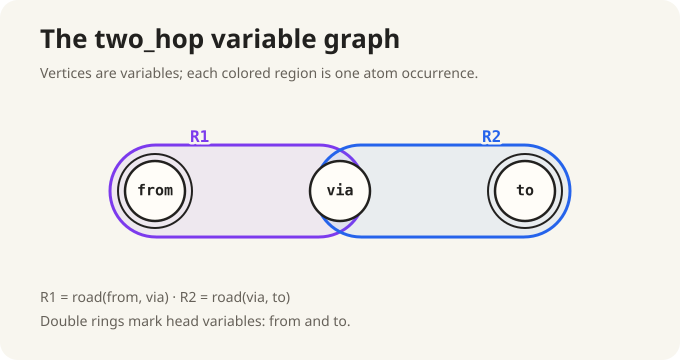
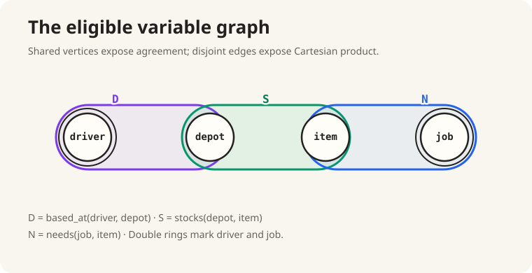

# The picture that did not choose

:::ada
Return to

```text
eligible(driver, job) :-
    based_at(driver, depot),
    stocks(depot, item),
    needs(job, item).
```

Call the three body-atom occurrences `D`, `S`, and `N`. Before looking at any
rows, which pairs share a variable?
:::alice
`D` and `S` share `depot`; `S` and `N` share `item`; `D` and `N` share no
variable.
:::

:::ada
Those overlaps belong to the query; the tuple counts came from one input. We
need a variable-side picture of the query. Return to the binary query

```text
two_hop(from, to) :-
    road(from, via),
    road(via, to).
```

Use one vertex per variable and one edge per body-atom occurrence. Which vertex
must the two edges share?
:::alice
They must share `via` because both atom occurrences use it.
:::

:::ada
The head retains `from` and `to`, so mark those vertices with double rings.



Every atom here has two variables, so this is still an ordinary graph. Apply the
same construction to `eligible`. Which edges meet?
:::alice
`D` and `S` meet at `depot`; `S` and `N` meet at `item`; `D` and `N` do not
meet.


:::

:::ada
What can this picture tell us about the three possible first pairs, and what
remains invisible without data?
:::alice
It recovers which first pairs share a variable and which pair is Cartesian. It
does not recover the join-output sizes `4, 8` or `16, 8`; those depended on the
input rows and their repeated values.
:::

:::ada
Now change one feature of a path. Begin with

```text
edge(a, b),
edge(b, c).
```

Compare two possible third occurrences:

```text
edge(c, d)
edge(c, a)
```

Which one adds a fresh vertex?
:::alice
`edge(c, d)` adds `d`. In `edge(c, a)`, both variables already occur in the
path.
:::

:::ada
Then in

```text
on_triangle(a) :-
    edge(a, b),
    edge(b, c),
    edge(c, a).
```

what can the third occurrence do after the first two have bound `a`, `b`, and
`c`?
:::alice
It introduces no variable. It can only check whether the already-bound values
for `c` and `a` satisfy `edge(c,a)`.


:::

:::ada
The next query contains an occurrence that an ordinary two-endpoint edge cannot
represent:

```text
trip(from, to) :-
    leg(from, hub, carrier),
    partner(carrier, partner),
    leg(hub, to, partner),
    open(from, day),
    open(to, day).
```

Call the occurrences `L1`, `P`, `L2`, `O1`, and `O2`. Why can `L1` not be one
ordinary edge without losing or splitting information?
:::alice
`L1` contains three variables: `from`, `hub`, and `carrier`. An ordinary edge
has only two endpoints. Splitting it would also lose the fact that one atom
occurrence contains all three variables together.
:::

:::definition Query hypergraph (course adaptation)
An ordinary edge generalizes to a **hyperedge**, one region that may contain any
number of variable vertices. For a conjunctive query with body atoms \(B_1,\ldots,B_n\), its query
hypergraph has the body variables as vertices and one labeled hyperedge

$$
e_i=\operatorname{vars}(B_i)
$$

for each body-atom occurrence. Labels keep two occurrences distinct even when
they use the same relation name or contain the same variables. Head variables
are marked as the output interface.
:::

:::reading
**Book definition and course adaptation.** Abiteboul, Hull, and Vianu,
[*Foundations of Databases*, Chapter 6](http://webdam.inria.fr/Alice/pdfs/Chapter-6.pdf),
§6.4, pp. 130–131, defines a schema hypergraph with attributes as vertices and
relation schemas as hyperedges. Applying that construction to each labeled CQ
atom's variable schema gives the query hypergraph used here. Occurrence labels
and head markings are course additions. Section 6.1, pp. 112–114, gives the
related sip graph based on atom overlap.
:::

:::definition Drawing a query hypergraph (course procedure)
1. Label every body-atom occurrence.
2. Create one vertex for every body variable.
3. For each occurrence, draw one labeled hyperedge around exactly its variables.
4. Mark the variables that occur in the query head.
5. Check both directions: every atom variable lies in its edge, and every edge
   corresponds to exactly one atom occurrence.

A constant may annotate an occurrence, but it is not a variable vertex.
:::

:::ada
Build `trip` one occurrence at a time. Begin with `L1`. Which vertices does its
hyperedge contain?
:::alice

```text
L1 = {from, hub, carrier}.
```
:::

:::ada
Add `P`. Where does it meet `L1`, and which vertex is new?
:::alice

```text
P = {carrier, partner}.
```

It meets `L1` at `carrier` and adds `partner`.
:::

:::ada
Add `L2`. Which variables are already present, and which is new?
:::alice

```text
L2 = {hub, to, partner}.
```

It reuses `hub` from `L1` and `partner` from `P`; only `to` is new.
:::

:::ada
Add `O1`. Which vertex is already present, and which is new?
:::alice

```text
O1 = {from, day}.
```

`from` is already present; `day` is new.
:::

:::ada
Add `O2`. How does it attach to both the earlier query and `O1`?
:::alice

```text
O2 = {to, day}.
```

It attaches to the earlier query through `to` and to `O1` through `day`.


:::

:::ada
Begin with only `L1` chosen. Which variables are now bound?
:::alice
The bound variables are `{from, hub, carrier}`.
:::

:::ada
Which unchosen occurrences share at least one of those variables?
:::alice
`P` shares `carrier`, `L2` shares `hub`, and `O1` shares `from`. `O2` shares no
bound variable yet.
:::

:::definition Bound variables and frontier (course definitions)
Planning will update the chosen variables and available neighboring occurrences
repeatedly. For chosen hyperedges \(C\), define

$$
\operatorname{bound}(C)=\bigcup_{e\in C}e,
\qquad
\operatorname{frontier}(C)=
\{e\notin C\mid e\cap\operatorname{bound}(C)\neq\varnothing\}.
$$

The frontier contains the unchosen atom occurrences sharing a variable with the
chosen part of the query. **Bound** and **frontier** are course terms attached
to the query-hypergraph adaptation above.
:::

:::reading
**Course definitions; book basis.** Abiteboul, Hull, and Vianu,
[*Foundations of Databases*, Chapter 6](http://webdam.inria.fr/Alice/pdfs/Chapter-6.pdf),
§6.1, pp. 112–114, supplies the related atom-overlap sip graph. The chosen-set
union and the name **frontier** are course constructions used for the planning
sequence here.
:::

:::ada
If `P` is added to `L1`, what remains on the frontier?
:::alice
The bound set gains `partner`. `L2` remains on the frontier through `hub` and
`partner`, and `O1` remains through `from`. `O2` still shares no bound variable,
so the frontier is `{L2, O1}`.
:::

:::ada
Has the hypergraph chosen between `L2` and `O1`?
:::alice
No. It only exposes both shared-variable extensions and the variable supporting
each one.
:::

:::ada
Can it predict which choice will carry fewer tuples?
:::alice
No. It contains no input rows, value frequencies, cardinality estimates, or
planning policy.
:::
