# The variables inside the picture

:::ada
In 2.2, the `stocks` label kept `depot,item` together inside one SIP
vertex. Let us open that vertex to show the variables it constrains together.

Suppose stock also depends on a day. A `stocks_on(depot,item,day)` tuple
says that the depot stocks the item on that day:

```text
eligible_on(driver, job, day) :-
    based_at(driver, depot),
    stocks_on(depot, item, day),
    needs(job, item).
```

Call these occurrences $D,S,N$, in written order. $S$ now constrains
three variables together.
:::alice
The SIP edges do not change. `day` occurs only in $S$, so it appears in
that atom's label without making a new connection to $D$ or $N$.

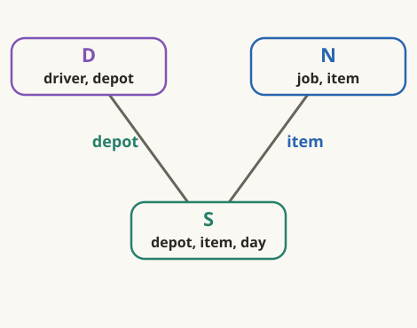
:::

:::ada
Suppose $D$ and $N$ have already been combined. Their candidate has a
driver, depot, job, and item. What does the next stock tuple have to do?
:::alice
Match its depot and item, then supply a day. The two matches have to
succeed in the same stock tuple.
:::

:::ada
Open $S$ like this: give each of its variables a vertex and put one boundary
around them, still labeled $S$. The boundary stands for the atom's joint
tuple test.

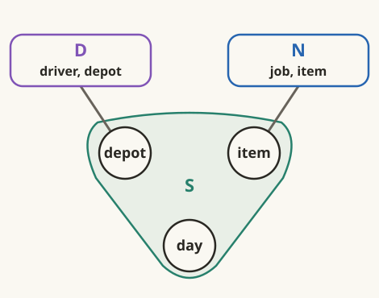
:::alice
When we open $D$, it will have a `depot` too. Are we going to draw that
variable twice?
:::

:::ada
Temporarily. The dashed construction guide marks two appearances of the
same query variable. We will merge them into one vertex.

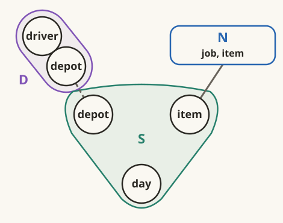
:::alice
Then both groups will contain that one vertex. Their chosen tuples have
to use the same depot value.
:::

:::ada
Here is the merge. Keep the two atom boundaries: $D$ still tests a
driver–depot pair, and $S$ still tests a depot–item–day triple.

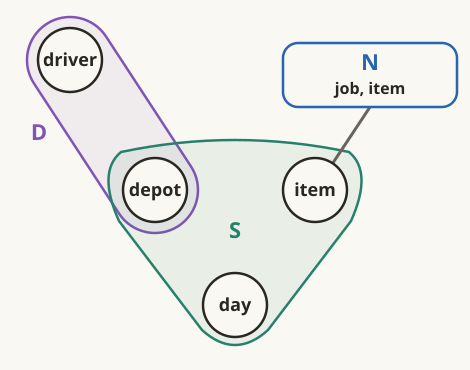
:::alice
The overlap takes the place of the old `depot` edge between $D$ and $S$.

I can do $N$ now. Its `job` is new to this drawing, but its `item` is
already inside $S$.
:::

:::ada
Here is $N$ opened. Merge the two appearances of `item` in the same way.

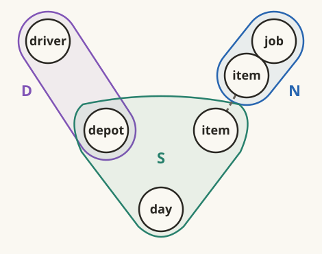
:::alice
One `item` vertex, belonging to both $S$ and $N$:

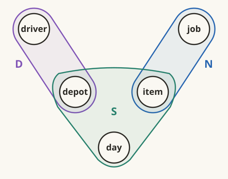
:::

:::ada
Read our earlier join step from this picture. $D$ and $N$ have been
combined, and $S$ is next.
:::alice
$S$ overlaps $D$ at `depot` and $N$ at `item`. It must match both.
Only $S$ contains `day`, which it adds.

I could have worked that out from the SIP labels too.
:::

:::ada
You could. Opening the atoms makes their variable groups and overlaps
visible directly; the SIP labels already contained that information.
:::alice
Why use a boundary for $S$, though? With three variable vertices, I could
draw an ordinary edge between each pair.
:::

:::ada
What would an edge between `depot` and `day` require of their values?
:::alice
That they occur together in a stock tuple. I would make the same test for
`depot,item` and for `item,day`.

If all three pairs pass, haven't I checked the three values?
:::

:::ada
Let us try it. Keep `eligible_on` unchanged and use these tables. First,
what does the original query return?

**based_at**

| driver | depot |
|---|---|
| Lin | north |

**stocks_on**

| depot | item | day |
|---|---|---|
| north | bolt | Mon |
| north | nut | Tue |
| south | bolt | Tue |

**needs**

| job | item |
|---|---|
| job1 | bolt |
:::alice
Only `(Lin,job1,Mon)`. Lin is at north, and job1 needs bolt. The only stock
tuple with both north and bolt has Mon.
:::

:::ada
So the original query rejects `(Lin,job1,Tue)`. Would your pair checks
reject it too? Start with the pair `(north,bolt)`.
:::alice
That pair occurs in the first stock row. My `depot,item` check passes.

But that row says Mon. I still have to check Tue.
:::

:::ada
Look for `(north,Tue)` in the `depot,day` columns.
:::alice
The second row has it—with nut. So this check passes too.

The last check is `(bolt,Tue)`. That is in the third row, with south.
All three pass!
:::

:::ada
Which stock tuple would you use to justify the Tuesday answer?
:::alice
There isn't one. I used a different tuple for each pair.

Checking every pair did not force the whole triple to be present.
:::

:::ada
The projections from 1.3 express exactly those separate checks:

$$
P_{di}=\pi_{depot,item}(S),
$$
$$
P_{dt}=\pi_{depot,day}(S),
$$
$$
P_{it}=\pi_{item,day}(S).
$$

Replacing the one stock atom with those three tests gives this query:

```text
eligible_pairs(driver, job, day) :-
    based_at(driver, depot),
    P_di(depot, item),
    P_dt(depot, day),
    P_it(item, day),
    needs(job, item).
```
:::alice
It returns `(Lin,job1,Tue)`: north and bolt satisfy `P_di`, north and Tue
satisfy `P_dt`, and bolt and Tue satisfy `P_it`.

My drawing changed what the query accepts. I need one test for the whole
stock tuple.
:::

:::reading
**Further reading.** Abiteboul, Hull, and Vianu,
[Foundations of Databases, Chapter 8](https://webdam.di.ens.fr/Alice/pdfs/Chapter-8.pdf#page=12),
§8.3, Definition 8.3.1, p. 170, formalizes equality between a relation and
the join of its projections as a *join dependency*. No such dependency was assumed for
`stocks_on`; our instance shows that the pair projections need not recover it.
:::

:::ada
That boundary around `depot,item,day` represents a **hyperedge**: a group
of vertices that can contain more than an ordinary edge's two endpoints.

Our **query hypergraph** has one vertex per body variable and one labeled
hyperedge per body occurrence, containing all that atom's variables.


:::alice
The group says these values must pass one test together. The actual stock
table says which triples pass.

Can a group have only one variable? We had `approved(task)` earlier.
:::

:::ada
Yes. Put it back in its query:

```text
approved_task(person, task) :-
    member(person, team),
    handles(team, task),
    approved(task).
```

Try drawing all three groups.
:::alice
`member` contains `person,team`, and `handles` contains `team,task`.
`approved` has just `task`:


That group can still reject a task.
:::

:::definition Hypergraph and hyperedge
A **hypergraph** \(H=(V,F)\) consists of vertices \(V\) and a family \(F\)
of distinct nonempty subsets of \(V\). Each member of \(F\) is an **edge**
or **hyperedge**; it need not have exactly two vertices.

Viewing each relation schema as its set of attributes, the book associates
with a database schema \(\mathcal R\) the hypergraph

$$
H_{\mathcal R}=(U,\mathcal R),
\qquad U=\bigcup_{R\in\mathcal R}R.
$$
:::

:::reading
**Book definition.** Abiteboul, Hull, and Vianu,
[Foundations of Databases, Chapter 6](https://webdam.di.ens.fr/Alice/pdfs/Chapter-6.pdf#page=26),
§6.4, p. 130, gives both unnumbered definitions below Figure 6.12: a
hypergraph and the hypergraph of a database schema.
:::

:::definition Query hypergraph (course adaptation with occurrence labels)
For relational body occurrences \(A_1,\ldots,A_m\), put
\(X_i=\operatorname{vars}(A_i)\) and

$$
V=\bigcup_{i=1}^{m}X_i.
$$

Our query drawing uses \(V\) as its vertices and keeps one group \(X_i\)
for each occurrence, labeled by the full atom \(A_i\). All body atoms in
this conversation have at least one variable, so these groups are nonempty.

Two occurrences retain separate labels even when their variable sets
coincide. If those repeated sets are identified, the underlying hypergraph
in the book's sense is \((V,\{X_i\mid 1\le i\le m\})\).
:::

:::reading
**Course adaptation; book basis.** Abiteboul, Hull, and Vianu,
[Foundations of Databases, Chapter 6](https://webdam.di.ens.fr/Alice/pdfs/Chapter-6.pdf#page=26),
§6.4, p. 130. We apply the schema construction to atoms' variable sets.
The occurrence labels preserve argument positions and separate tuple tests;
they are our addition to the book's construction.
:::

:::ada
For a group of exactly two variables, we can use an ordinary line as
shorthand. In

```text
one_road(a, b) :- road(a, b).
```

these drawings represent the same atom occurrence $E_1$:

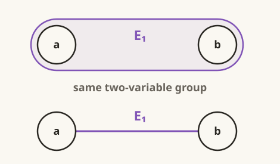
:::alice
So drawing a line was not itself my mistake. Here the line stands for
one binary atom. I tried to replace a three-variable atom with three
separate tests.
:::

:::ada
Your three lines do describe `eligible_pairs`:

```text
eligible_pairs(driver, job, day) :-
    based_at(driver, depot),
    P_di(depot, item),
    P_dt(depot, day),
    P_it(item, day),
    needs(job, item).
```

Draw its five body occurrences, keeping $D$ and $N$ in place.
:::alice
The three projected atoms go between them:

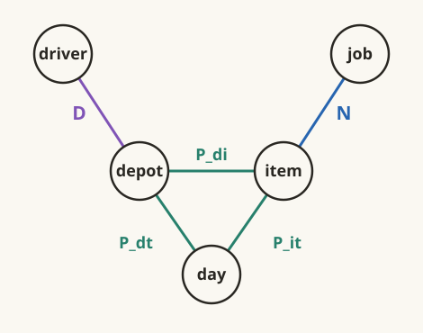

This is where the extra Tuesday answer came from. There is no longer one
stock group requiring all three values together.
:::

:::ada
Those five hyperedges had different variable sets. What if two atoms
contain exactly the same variables?

```text
return_trip(a) :-
    road(a, b),
    road(b, a).
```

Call the occurrences $E_1$ and $E_2$.
:::alice
Both groups contain exactly `a,b`, but I still need a road in each
direction.

The groups alone will not show which argument comes first.
:::

:::ada
Suppose `road` contains only `(0,1)`. Can `a=0` be an answer?
:::alice
The first atom makes `b=1`. Then the second needs `(1,0)`, which is missing.
So no.

If I forgot the second occurrence's argument order, I could count the
outward road twice and think I had a return trip.
:::

:::ada
Here is the query hypergraph. Its vertices are the variables `a,b`.
Each labeled curve represents one two-variable hyperedge, using our line
shorthand:

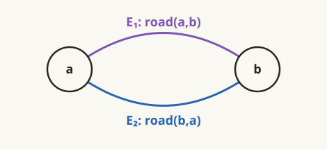

The two groups contain the same vertices. Their atom labels preserve the
different tuple tests.
:::alice
With `a=0,b=1`, $E_1$ asks for `(0,1)`, while $E_2$ asks for `(1,0)`.
The groups coincide, but the tests differ.
:::

:::ada
The atom label also matters when one occurrence repeats a variable:

```text
self_loop(x) :- road(x, x).
```

How many variable vertices and hyperedges does this query have?
:::alice
One variable vertex, `x`, and one singleton hyperedge for the one atom:

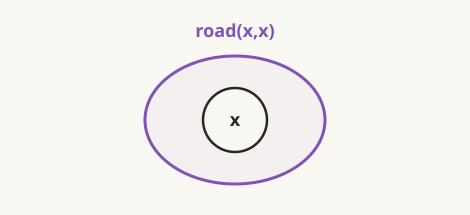

The label `road(x,x)` still requires equal endpoints. Our stored tuple
`(0,1)` would fail that test.
:::

:::reading
**Course examples; book basis.** Abiteboul, Hull, and Vianu,
[Foundations of Databases, Chapter 4](https://webdam.di.ens.fr/Alice/pdfs/Chapter-4.pdf#page=5),
§4.2, Definition 4.2.1 and the valuation semantics on p. 41, determine the
tuple test from an atom's ordered arguments. The road examples apply those
semantics; retaining the full atom labels is our query-drawing convention.
:::

:::ada
We have checked how to read individual hyperedges. Now compare how they
overlap, starting with our three roads from a common origin:

```text
shared_origin(a, b, c) :-
    road(h, a),
    road(h, b),
    road(h, c).
```

Bring back the earlier **SIP graph**, whose vertices are occurrences
$E_1,E_2,E_3$ in written order. Open them and merge appearances of the same
variable to obtain the query hypergraph.


:::alice
Each opened group contains `h`. Merging those appearances gives one center:


The triangle in the first picture came from every pair sharing that same
center variable.
:::

:::ada
Compare it with this query:

```text
round_trip(a, b, c) :-
    road(a, b),
    road(b, c),
    road(c, a).
```

Start with its SIP graph, again numbering occurrences in written order.
:::alice
Every pair shares a variable, so I get another triangle.

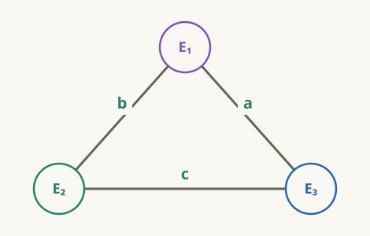

This time the three edges have different labels. I cannot merge all the
shared variables into one center.
:::

:::ada
Apply the same opening rule, merging only appearances of the same variable.
:::alice
$E_1$ contains `a,b`, $E_2$ contains `b,c`, and $E_3$ contains `c,a`.


Now the variable picture has a loop too.
:::

:::ada
Recall the two connections from 2.2. Each road hyperedge
keeps its variables together in one tuple test, just as `stocks` kept
`depot,item` together. Where do you see agreement on a shared variable
across atoms?
:::alice
Where the groups meet. In the star, all three roads must agree on `h`.
In the loop, each pair agrees on a different variable: `a`, `b`, or `c`.
There is no common center.
:::

:::ada
The SIP triangles' labels recorded that distinction. Opening the atoms
makes it visible as a star and a loop.
:::alice
We never looked at the road tuples to draw either one. If `road` were
empty, would this still be the loop-shaped query?
:::

:::ada
Yes. No tuples would pass, but the query would still impose the same
three pair constraints.
:::alice
Then seeing a loop here does not tell me how many round trips exist.
I need the road tuples for that, just as I needed the stock tuples for
the five-versus-three counts in 2.1.

The picture still contains every variable. Must the plan keep them all?
:::
