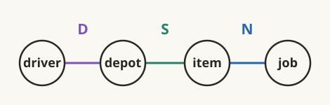
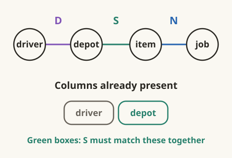
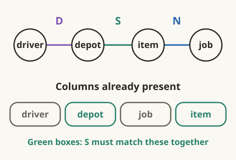
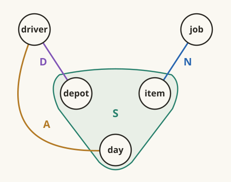
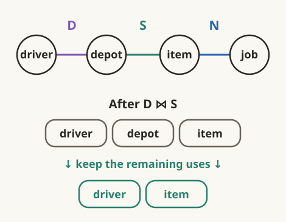
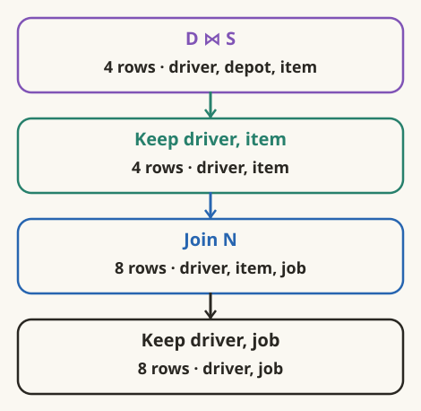
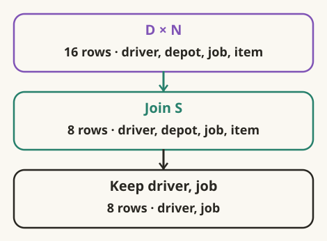
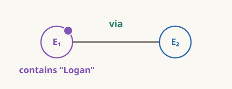

# The variables the plan still needed

:::ada
Let us follow the columns through a plan. Return to our delivery query,
without the day:

```text
eligible(driver, job) :-
    based_at(driver, depot),
    stocks(depot, item),
    needs(job, item).
```

Call the body occurrences $D,S,N$ as before.



Start with $D$, then join $S$. Which variable must match? Which is new?
:::alice
`depot` must match. `item` is new.



The result has `driver,depot,item`.
:::

:::ada
Instead start with $D\times N$, then join $S$. Same query, same stock atom.
What must $S$ check now?
:::alice
Now both `depot` and `item` are already present. $S$ must match them
together and adds no new column.


:::

:::ada
Suppose a product candidate is

| driver | depot | job | item |
|---|---|---|---|
| Lin | north | job3 | nut |

and $S$ contains only

| depot | item |
|---|---|
| north | bolt |
| south | nut |

Does the candidate survive?
:::alice
No. Neither stock tuple matches the whole pair `(north,nut)`.

Both values must come from one tuple, as with the dated stock in 2.3.
:::

:::ada
A join can extend a candidate or only filter it. Which it does depends on
the columns already present.
:::alice
So $S$ did not change; the partial result did. Could $S$ have to match
three columns?
:::

:::definition Matched and new columns
Let $V$ be the current schema and $E$ the next atom's variable set. The join
matches every column in $E\cap V$ and adds the columns in $E\setminus V$.
Its result schema is $V\cup E$.

If $E\cap V=\varnothing$, the join is a Cartesian product. If
$E\setminus V=\varnothing$, it can only filter the current relation under
set semantics.
:::

:::reading
**Book rule; course notation.** Abiteboul, Hull, and Vianu,
[Foundations of Databases, Chapter 4](https://webdam.di.ens.fr/Alice/pdfs/Chapter-4.pdf#page=21),
§4.4, pp. 57–58, defines natural join by agreement on all shared attributes.
The sets above express that rule for query variables.
:::

:::ada
Yes—even when the columns came from different atoms.
Here, `available(driver,day)` records a driver's available days:

```text
ready_on(driver, job, day) :-
    based_at(driver, depot),
    needs(job, item),
    available(driver, day),
    stocks_on(depot, item, day).
```

Use $A$ for `available` and $D,N,S$ for the other occurrences. Combine
the first three. What must the final stock atom match? What can it add?
:::alice
It matches the entire set `{depot,item,day}` and adds nothing.



`depot` arrived through `based_at`, `item` through `needs`, and `day`
through `available`.
:::

:::ada
Suppose those earlier atoms produced

| driver | depot | job | item | day |
|---|---|---|---|---|
| Lin | north | job1 | bolt | Tue |

Use the dated stock rows from 2.3:

| depot | item | day |
|---|---|---|
| north | bolt | Mon |
| north | nut | Tue |
| south | bolt | Tue |

Keep or discard this candidate?
:::alice
Discard it. The required triple `(north,bolt,Tue)` is absent.

The pairwise witnesses still do not supply one matching stock tuple.
:::

:::ada
Return to the query without the day or availability test:

```text
eligible(driver, job) :-
    based_at(driver, depot),
    stocks(depot, item),
    needs(job, item).
```

We have computed $D\bowtie S$, with columns `driver,depot,item`. Only $N$
remains.

Who still needs `item`? Who still needs `driver`?
:::alice
$N$ needs `item` to check the job's requirement. The head needs `driver`
to report the answer.
:::

:::ada
Who still needs `depot`?
:::alice
Neither the remaining atom nor the head.

The join has already checked the depot connection. We can keep just
`driver,item`.


:::

:::ada
Would this work even if two depots connected the same driver and item?

| driver | depot | item |
|---|---|---|
| Lin | north | bolt |
| Lin | south | bolt |

What does projection onto `driver,item` return?
:::alice
One tuple, `(Lin,bolt)`, under set semantics.

$N$ can inspect only the item, and the head returns only driver and job.
Two depot witnesses would not create two distinct answers.
:::

:::ada
Then why not discard `depot` immediately after reading $D$?
Use this small instance of the same query:

| $D$: driver | depot |
|---|---|
| Lin | north |

| $S$: depot | item |
|---|---|
| south | nut |

| $N$: job | item |
|---|---|
| job3 | nut |

First, what is the correct answer?
:::alice
Empty. Lin's depot is north, but the only stock tuple is at south.
The $D$–$S$ match fails.
:::

:::ada
Now replace $D$ by $\pi_{driver}(D)$ before joining $S$. What happens?
:::alice
The depot column that carried the required agreement is gone.
`driver` and `depot,item` have no shared column, so the first combination
admits `(Lin,south,nut)`.

Joining $N$ then produces the false answer `(Lin,job3)`.

We could discard `depot` **after** its last test, but not before that test.
:::

:::ada
After the valid $D\bowtie S$ step, could we discard `driver` too?
No remaining body atom uses it.
:::alice
The head still does. If we discard it, we cannot report which driver can
do the job.

So the head counts as a remaining use too.
:::

:::ada
Yes. Suppose a completed part of the body is $C$. Who might still need
one of its variables?
:::alice
An unprocessed atom, the head, or a condition we have not tested yet.
:::

:::law Keep every remaining use
For the positive conjunctive queries here, a sufficient retained schema is

$$
\operatorname{keep}(C)=\operatorname{vars}(C)\cap
\bigl(H\cup\operatorname{vars}(B\setminus C)\cup P\bigr),
$$

Here $B$ is the set of relational body occurrences, $C\subseteq B$ is the
completed part, $H$ contains the head variables, and $P$ contains the variables
used by pending conditions. The variables of a set of atoms are the union
of their variable sets. In our examples so far, $P=\varnothing$.

We use set semantics and assume no additional dependencies that would let us
reconstruct a discarded value. The rule applies to any completed subtree,
not just a prefix of the written body.
:::

:::reading
**Course rule; book basis.** Abiteboul, Hull, and Vianu,
[Foundations of Databases, Chapter 6](https://webdam.di.ens.fr/Alice/pdfs/Chapter-6.pdf#page=10),
§6.1, Example 6.1.3, p. 114, explains forgetting variables after their last
use. Exercises 6.4–6.5, p. 137, ask for a projection policy and planning
over binary trees. The retained-set formula, including pending conditions,
is our formulation.
:::

:::ada
Check the other starting pair in `eligible`: complete $S\bowtie N$ first.
It has `depot,item,job`. What can disappear?
:::alice
`item`. The remaining $D$ needs `depot`, and the head needs `job`.
Keep `{depot,job}`.
:::

:::ada
Return once more to `ready_on`. Its final stock atom has just checked all
three shared columns. What does the completed body retain for the head?
:::alice
`driver,job,day`. Both `depot` and `item` can now disappear.

The stock test needed them; the head does not.
:::

:::ada
Does discarding an intermediate column erase its variable from the original
query graph?
:::alice
No. Its constraints stay in the query. The intermediate carries fewer
columns because some tests are finished.

How much does that save in a plan?
:::

:::ada
Let us measure the effect. Use the first instance from 2.1 again:

| $D$: driver | depot |
|---|---|
| Lin | north |
| Moe | north |
| Nia | south |
| Omar | south |

| $S$: depot | item |
|---|---|
| north | bolt |
| south | nut |

| $N$: job | item |
|---|---|
| job1 | bolt |
| job2 | bolt |
| job3 | nut |
| job4 | nut |

Starting with $D\bowtie S$, how many rows and columns do we get before
and after the safe projection?
:::alice
Before: four rows and three columns. After: four rows and two columns.

The four driver–item pairs are distinct, so this projection reduces columns
without reducing rows.

| driver | item |
|---|---|
| Lin | bolt |
| Moe | bolt |
| Nia | nut |
| Omar | nut |
:::

:::ada
Continue that plan through $N$, then project to the head. Annotate every
step with both its row count and its schema.
:::alice
Each driver–item pair matches two jobs.


:::

:::ada
Try product first. After $D\times N$, may we discard either `depot`
or `item` before joining $S$?
:::alice
No. $S$ still needs both, while the head needs `driver,job`. All four
columns must stay.


:::

:::ada
Count columns immediately after each displayed join or projection.
What is the largest intermediate arity in each plan?
:::alice
Three in the driver-first plan, four in the product-first plan.

Without early projection, the complete body would have all four columns in
both orders. The measurement depends on where the projections occur.
:::

:::ada
Now keep only answers whose `job` is `job1`. Keep the same head columns
`driver,job`.

Apply $N'=\sigma_{job=job1}(N)$. What changed: rows, columns, or both?
:::alice
Rows. $N'$ contains just `(job1,bolt)`, but still has the two columns
`job,item`.

The selected relation has the same schema.
:::

:::ada
The condition uses only `job`, which is already available in $N$. A rejected
$N$ tuple could not contribute to a selected answer, so we can test it here.

What does $S\bowtie N'$ contain?
:::alice
One tuple:

| depot | item | job |
|---|---|---|
| north | bolt | job1 |
:::

:::reading
**Book equivalence.** Abiteboul, Hull, and Vianu,
[Foundations of Databases, Chapter 6](https://webdam.di.ens.fr/Alice/pdfs/Chapter-6.pdf#page=6),
§6.1, pp. 110–111, Figure 6.2, gives selection-pushing rewrite rules.
Exercise 6.1, p. 136, asks for the conditions under which they preserve
equivalence; here the condition uses only `job` from $N$.
:::

:::ada
Which column can disappear now? Then how many drivers match?
:::alice
Discard `item`, keeping `depot,job`. $D$ matches Lin and Moe at north,
giving the two answers `(Lin,job1)` and `(Moe,job1)`.
:::

:::ada
Could a semijoin communicate the same restriction to the stock input?
Compute $S\ltimes N'$. What is its schema?
:::alice
It keeps the stock tuples having a partner in $N'$:

| depot | item |
|---|---|
| north | bolt |

The schema is still $S$'s `depot,item`. The semijoin filters the left
relation; it does not bring `job` into it.
:::

:::reading
**Book definition recalled.** Abiteboul, Hull, and Vianu,
[Foundations of Databases, Chapter 6](https://webdam.di.ens.fr/Alice/pdfs/Chapter-6.pdf#page=24),
§6.4, p. 128, defines $I\ltimes J=\pi_{\operatorname{schema}(I)}(I\bowtie J)$.
This is the semijoin used for the prefilter in 2.1.
:::

:::ada
Use unrestricted $N$ again. North's bolt matches two jobs. How many copies
of `(north,bolt)` does $S\ltimes N$ contain?
:::alice
One. Existence of a partner is enough. In this instance $S\ltimes N$ has
two stock tuples, whereas $S\bowtie N$ has four depot–item–job tuples.

If we need the jobs, the semijoin alone does not provide them.
:::

:::ada
We have reduced columns with projection and rows with filtering. What did
your three-versus-four comparison measure?
:::alice
Columns in the intermediate results. Selecting `job1` reduced rows instead.
We should name those quantities separately.
:::

:::definition Three size measures
For a relation $I$ with schema $V$:

| Quantity | What we count |
|---|---|
| Cardinality | $\lvert I\rvert$: tuples in the relation |
| Logical arity | $\lvert V\rvert$: columns in its schema |
| Physical tuple width | Bytes used to represent a tuple; dependent on types and layout |
:::

:::reading
**Course terminology.** The table fixes our use of these three measurements.
Abiteboul, Hull, and Vianu,
[Foundations of Databases, Chapter 6](https://webdam.di.ens.fr/Alice/pdfs/Chapter-6.pdf#page=2),
§6.1, pp. 106–107, distinguishes logical plans from physical representation
and execution costs. Graph-decomposition widths are separate measures,
introduced later.
:::

:::ada
Does selecting `job1` change the variable groups in our query hypergraph?
:::alice
No. It changes which tuples pass, while the variables and overlaps stay
the same. What if we write a constant inside an atom instead?
:::

:::ada
Then that occurrence is restricted by the constant. Try:

```text
from_logan(to) :-
    road("Logan", via),
    road(via, to).
```

Use the SIP convention from 2.2: mark a vertex containing a constant with
a small filled dot. Call the occurrences $E_1,E_2$.
:::alice
The first vertex is marked. The shared variable is still `via`.



The literal selects tuples of the first occurrence. It is not a
query-variable vertex when we open the atoms into a hypergraph.
:::

:::reading
**Book convention.** Abiteboul, Hull, and Vianu,
[Foundations of Databases, Chapter 6](https://webdam.di.ens.fr/Alice/pdfs/Chapter-6.pdf#page=9),
§6.1, p. 113, specifies the constant mark in the SIP-graph definition.
:::

:::ada
We can now match a whole shared set, filter tuples, and retain only needed
columns. Is every surviving tuple therefore part of a complete answer?
:::alice
Not yet. We have checked the constraints processed so far. A remaining
constraint can still reject it.

But what if it has a partner in every other atom? Would that be enough?
:::
