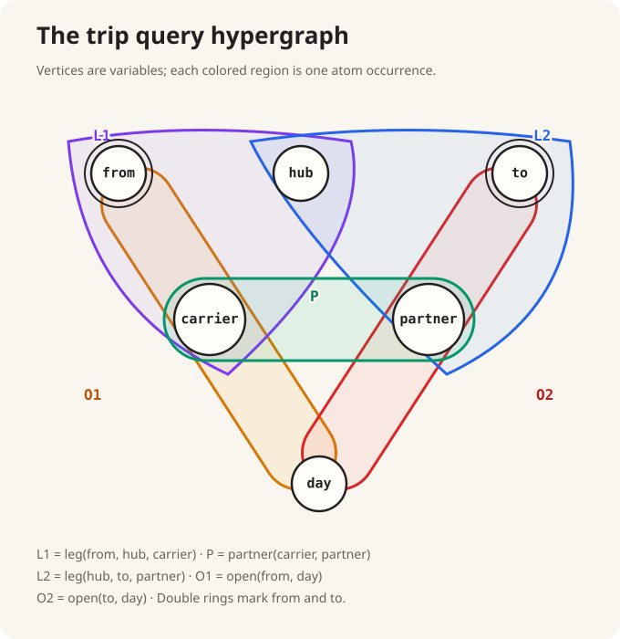
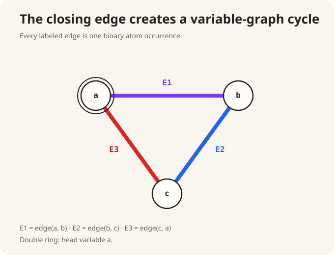

# The variables the plan still needed

:::ada
Return to

```text
trip(from, to) :-
    leg(from, hub, carrier),
    partner(carrier, partner),
    leg(hub, to, partner),
    open(from, day),
    open(to, day).
```

Call the occurrences `L1`, `P`, `L2`, `O1`, and `O2` in source order.



Starting with only `L1`, which unchosen occurrences share one of its variables?
:::alice
`P` shares `carrier`, `L2` shares `hub`, and `O1` shares `from`. `O2` shares
none of `L1`'s variables.
:::

:::ada
First construct two valid binary expressions without claiming either is
cheaper. Grow one accumulated expression through the order
`L1, P, L2, O1, O2`.
:::alice
That gives

$$
((((L_1\bowtie P)\bowtie L_2)\bowtie O_1)\bowtie O_2).
$$

Every join adds one atom to the accumulated left operand.
:::

:::ada
Now construct the `L1`, `P`, `L2` group and the `O1`, `O2` group separately
before combining them.
:::alice
That gives

$$
((L_1\bowtie P)\bowtie L_2)\bowtie(O_1\bowtie O_2).
$$

The root combines two subexpressions rather than one subexpression and one atom.
:::

:::definition Left-deep and bushy expressions
A binary join-expression tree is **left-deep** when every right child of a join
node is an atom-expression leaf. It is **bushy** when some join node has two
non-leaf children.
:::

:::reading
**Course terminology; book basis.** Abiteboul, Hull, and Vianu,
*Foundations of Databases*, Chapter 6, §6.1, pp. 112–114, discusses System R
join orderings. Exercise 6.4, p. 137, uses left-to-right join processing;
Exercise 6.5, p. 137, generalizes it to an arbitrary binary tree. The terms
**left-deep** and **bushy** are supplied here as course terminology.
:::

:::ada
How do the two expressions use the same hypergraph differently?
:::alice
The left-deep expression grows one chosen set by one frontier edge at a time.
The bushy expression grows two connected chosen sets and then combines them.
Both include every atom occurrence and preserve every shared-variable
agreement, so both denote the full body-valuation relation.
:::

:::definition Join planning (course umbrella term)
For this course, **join planning** chooses a binary natural-join expression
whose denotation is the complete body-valuation relation. A left-deep atom order
\(B_1,\ldots,B_n\) is **prefix-connected** within a query component when

$$
\operatorname{vars}(B_k)\cap
\bigcup_{i<k}\operatorname{vars}(B_i)\neq\varnothing
\qquad(2\leq k\leq n).
$$

Each new leaf then lies on the current frontier. Disconnected components
ultimately require Cartesian product. Correctness still requires every atom
occurrence and the CQ's final output schema and result.
:::

:::reading
**Course term/adaptation; book basis.** Abiteboul, Hull, and Vianu,
*Foundations of Databases*, Chapter 4, §4.4, pp. 57–58, supplies natural join
and its Cartesian-product case on disjoint sorts. Chapter 6, §6.1, pp. 112–114,
defines sip strategies in which each later relational atom is adjacent to an
earlier one, subject also to its constant and constraint cases; Exercise 6.5,
p. 137, permits arbitrary binary trees. **Prefix-connected** and **join
planning** are course terms for the restricted setting used here.
:::

:::ada
Can the `trip` hypergraph alone tell us which expression has lower logical row
volume on an unknown instance?
:::alice
No. It shows incidences and legal shared-variable extensions, but not relation
cardinalities or how their values overlap. With exact data we could compute the
intermediates as in Conversation 2.1a; without data or estimates, the graph alone
cannot rank the plans by row volume.
:::

:::ada
Our first compiler still needs one reproducible correct plan. It will use a
source-tied policy as an administrative baseline, not as a cost optimizer.
:::alice
Then the policy may choose among frontier atoms by source order while keeping
its lack of cost information explicit.
:::

:::definition Source-tied frontier scan (course algorithm)
Given the body atoms in source order:

1. Start with the earliest unplanned atom \(A\).
2. Set \(J=E_A\) and \(S=\operatorname{vars}(A)\).
3. Scan the remaining atoms in source order and choose the first \(B\) with
   \(\operatorname{vars}(B)\cap S\neq\varnothing\).
4. Replace \(J\) by \(J\bowtie E_B\), replace \(S\) by
   \(S\cup\operatorname{vars}(B)\), and repeat step 3.
5. If unplanned atoms remain but none intersects \(S\), choose the earliest one
   as \(B\), replace \(J\) by \(J\bowtie E_B\), and add its variables to \(S\).
   This boundary join is Cartesian; then resume step 3.

The algorithm uses no cardinality estimate and does not minimize logical row
volume.
:::

:::reading
**Course construction; book basis.** Abiteboul, Hull, and Vianu,
*Foundations of Databases*, Chapter 6, §6.1, pp. 112–114, discusses join
orderings, and Exercise 6.4, p. 137, explicitly uses left-to-right join
processing. The source-tied frontier scan above is a course algorithm, not an
algorithm stated in the book.
:::

:::ada
Apply the algorithm to `trip`, beginning at `L1`.
:::alice
After `L1`, source order chooses `P` from frontier `{P, L2, O1}`. The frontier
then contains `L2` and `O1`, so it chooses `L2`; `O1` and `O2` follow. The order
is

```text
L1, P, L2, O1, O2.
```

The resulting expression is the left-deep expression constructed earlier:

$$
((((L_1\bowtie P)\bowtie L_2)\bowtie O_1)\bowtie O_2).
$$
:::

:::ada
For any chosen order \(B_1,\ldots,B_n\), expose its left-deep subexpressions.
:::alice
$$
T_1=E_{B_1},
\qquad
T_i=T_{i-1}\bowtie E_{B_i}\quad(2\leq i\leq n).
$$

The assignments name intermediate relations. They do not require those
relations to be physically stored.
:::

:::ada
Each intermediate nevertheless has a schema. Could every \(T_i\) immediately
retain only the query-head variables?
:::alice
No. A body-only variable may still be needed to agree with an atom that has not
yet been joined. It may leave only after both its final body use and any head
use are finished.
:::

:::ada
Return to the familiar `on_triangle` hypergraph:



After joining `edge(a,b)` with `edge(b,c)`, may `b` be projected out?
:::alice
Yes. It was needed to combine the first two edges, but the remaining edge uses
`{c,a}` and the head uses `{a}`. Before the first join, removing `b` would
destroy its agreement condition.
:::

:::definition Required intermediate schema (course construction)
For chosen order \(B_1,\ldots,B_n\), let \(T_i\) be the intermediate after
\(B_1,\ldots,B_i\). Its required schema is the set of available variables
still needed by the head or a later atom:

$$
\operatorname{schema}(T_i)\cap
\left(
  \operatorname{vars}(\operatorname{head}(q))
  \cup\bigcup_{j>i}\operatorname{vars}(B_j)
\right).
$$
:::

:::reading
**Course construction; book basis.** This formula is derived here from
Abiteboul, Hull, and Vianu, *Foundations of Databases*, Chapter 6, §6.1,
Example 6.1.3, p. 114, and Exercise 6.4, p. 137. The book gives the projection
criterion but not this formula.
:::

:::ada
Why is one backward pass over the chosen order enough to compute those sets?
:::alice
Begin with the head requirements. Moving backward, add the variables required
by each atom that has not yet been crossed. At every plan position, that set is
exactly what the earlier intermediate must still provide.
:::

:::ada
What should the plan insert when an intermediate contains more variables than
its required set?
:::alice
A projection to the required variables. The query hypergraph supplies each
atom-variable incidence needed by the backward pass.
:::

:::ada
Apply the backward analysis to `on_triangle`. Which schema is required after
each atom?
:::alice

```text
after edge(a, b): {a, b}
after edge(b, c): {a, c}    // b has no remaining use
after edge(c, a): {a}
```

The first intermediate keeps `b` for the second atom. The next drops `b` but
keeps `a` for the head and `{a,c}` for the final atom.
:::

:::ada
Now spell that analysis as relational algebra.
:::alice

```text
relational {
    e1 = rename edge {src -> a, dst -> b};
    e2 = rename edge {src -> b, dst -> c};
    e3 = rename edge {src -> c, dst -> a};

    j2 = natural_join e1 with e2;       // {a, b, c}
    p2 = project j2 keep {a, c};        // {a, c}
    j3 = semijoin p2 with e3;           // {a, c}
    p3 = project j3 keep {a};           // {a}

    derive p3 into on_triangle by union;
}
```

`p2` drops `b` only after its final use. Because `e3` adds no required
attribute, `j3` retains the left schema and may be written as a semijoin.
:::

:::ada
Has any step chosen a hash table, index, nested loop, or iterator protocol?
:::alice
No. The chosen tree, named intermediates, projections, and semijoin are still
set-valued relational algebra. They say which relation each node denotes, not
how a machine obtains it.
:::

:::ada
Then separate the two remaining proof obligations.
:::alice
The CQ-to-algebra proof establishes

$$
[\![E_q]\!]_I=q(I).
$$

A later implementation proof must show that each physical operator produces
the relation denoted by its algebraic node. A data structure may change how the
node runs without changing what it means.
:::

:::reading
**Course term/adaptation; book basis.** This staged logical-plan/physical-
operator boundary is course framing derived from Abiteboul, Hull, and Vianu,
*Foundations of Databases*, Chapter 6, §6.1, pp. 112–114, especially its
planning examples and alternative physical implementations, together with
Exercise 6.4. The book does not present it as a named definition or theorem.
:::
