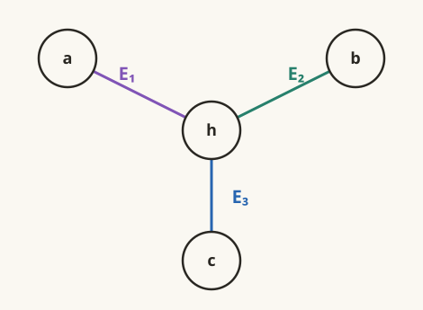
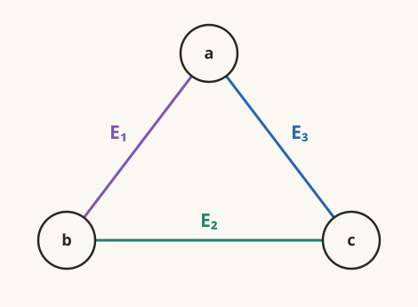
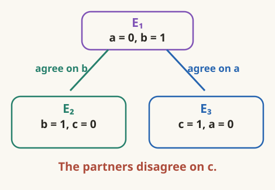
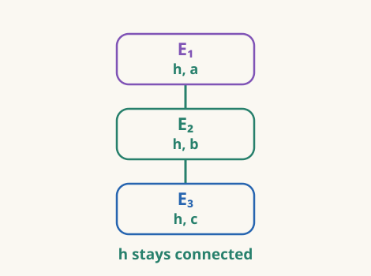
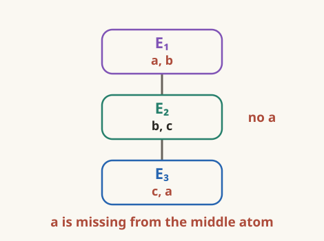
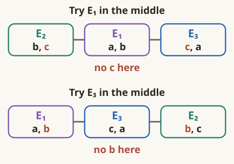
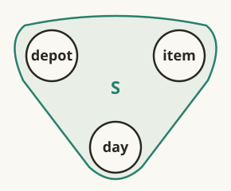
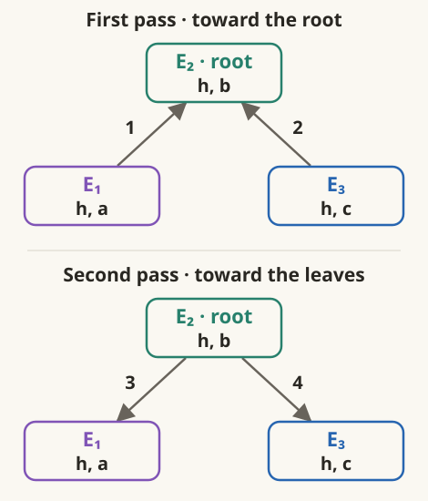
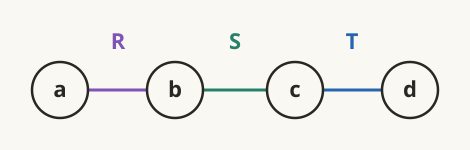
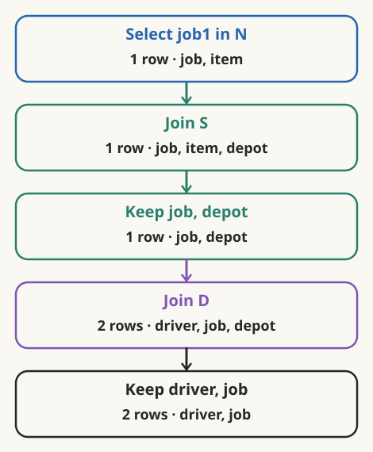

# The order the compiler chose

:::ada
Let us test whether separate partners can always fit together. Bring back
the two query shapes from 2.3, starting with the star:

```text
shared_origin(a, b, c) :-
    road(h, a),
    road(h, b),
    road(h, c).
```

Number these body occurrences $E_1,E_2,E_3$, as before.



Let `road` contain just `(0,1)` and `(1,0)`. What answers do we get?
:::alice
For `h=0`, all three endpoints must be 1, giving `(1,1,1)`.
For `h=1`, they must all be 0, giving `(0,0,0)`.

Each answer uses one common value of `h` across all three atoms.
:::

:::ada
Use the same two road tuples with the loop:

```text
round_trip(a, b, c) :-
    road(a, b),
    road(b, c),
    road(c, a).
```



Call the occurrences $E_1,E_2,E_3$. Start with `(a=0,b=1)` in $E_1$.
Which $E_2$ tuple can join it?
:::alice
`(b=1,c=0)`. The first two atoms give the candidate
`(a=0,b=1,c=0)`.
:::

:::ada
What does $E_3$ demand of that candidate?
:::alice
The road tuple `(c=0,a=0)`. There is no `(0,0)` road, so the candidate
fails.

Starting instead with `(a=1,b=0)` would require `(1,1)` at the end.
That also fails. The answer is empty.
:::

:::ada
Before doing a full join, could we remove `(a=0,b=1)` from $E_1$ by
semijoining with $E_2$? With $E_3$?
:::alice
Neither removes it. It has a partner in each:



The two partners cannot be used together. One assigns `c=0`, the other
`c=1`.
:::

:::ada
Check the other $E_1$ tuple, and then the tuples in $E_2$ and $E_3$.
Would repeating all pairwise semijoins eventually remove something?
:::alice
No. Swapping 0 and 1 gives the other tuple the same separate support, and
the three atom positions are symmetric.

Every pairwise semijoin leaves its left relation unchanged. Another pass
would have nothing new to use.
:::

:::definition Separate support and complete support
Let $I_i$ be the relation for body occurrence $E_i$, with schema $X_i$.
An atom tuple has **pairwise support** when it has a compatible partner in
each other atom relation. The family is **pairwise consistent** when this
holds for every tuple:

$$
I_i\ltimes I_j=I_i\qquad\text{for every }i,j.
$$

A tuple has **complete support** when it extends to one valuation satisfying
the whole body. The family is **globally consistent** when every tuple has
such an extension:

$$
I_i=\pi_{X_i}\left(\mathop{\bowtie}_j I_j\right)
\qquad\text{for every }i.
$$

A **full semijoin reducer** for a join schema is a fixed sequence of
semijoin replacements that makes the family globally consistent on every
input instance. Semijoins preserve the complete join, so exactly the tuples
with complete support survive.
:::

:::reading
**Formal definitions.** Abiteboul, Hull, and Vianu, [Foundations of
Databases, Chapter 6](https://webdam.di.ens.fr/Alice/pdfs/Chapter-6.pdf#page=24),
§6.4, pp. 128–129, defines pairwise and global consistency, semijoin
programs, and full reducers. “Separate support” and “complete support” are
our descriptions of the tuple conditions in those definitions.
:::

:::ada
What made separate partners work for the star's tuple `(h=0,a=1)`?

```text
shared_origin(a, b, c) :-
    road(h, a),
    road(h, b),
    road(h, c).
```
:::alice
The partner in `road(h,b)` and the partner in `road(h,c)` both use `h=0`.
Their other variables, `b` and `c`, are different query variables.

There is no additional agreement between those two choices waiting to fail.
:::

:::ada
Let us describe that structural difference. Arrange the star's three body
occurrences in a tree:

Each rectangle below is a body occurrence. The links belong to the proposed
tree; they are not the hyperedges in the previous picture.



Test this rule: for each variable, all atoms containing it must form a
connected part of the tree. Does `h` pass? What about `a,b,c`?
:::alice
`h` occurs in all three atoms, with no gap along either link. Each of
`a,b,c` occurs in just one atom, so each passes too.
:::

:::ada
Try the same tree arrangement for the loop:

```text
round_trip(a, b, c) :-
    road(a, b),
    road(b, c),
    road(c, a).
```



Which variable fails the test?
:::alice
`a`. It appears at the two ends, but the path between them passes through
$E_2$, which has only `b,c`.

`b` and `c` each occur in two adjacent atoms, so they pass this particular
arrangement.
:::

:::ada
That rejects one tree. Could a different middle atom repair it?
Draw the two other choices before answering.
:::alice


If $E_1$ is in the middle, `c` occurs at both ends and is missing in the
middle. If $E_3$ is in the middle, `b` has that problem.

Every three-vertex tree has a middle vertex. Whichever atom we put there
omits the variable shared by the endpoints. No tree passes.
:::

:::definition Join trees and acyclic queries
A **join tree** has one node for each body occurrence. For every variable,
the nodes whose atoms contain it must form a connected part of the tree.
Equivalently, every node on the path between two occurrences of a variable
must also contain that variable.

A query hypergraph is **α-acyclic**, shortened to **acyclic** here, when it
admits a join tree. The star admits one; the loop does not.

These tree links organize atom groups. They are not extra query constraints,
and this is not yet a binary evaluation tree with intermediate results.
:::

:::reading
**Formal definition and equivalence.** [Foundations of Databases,
Chapter 6](https://webdam.di.ens.fr/Alice/pdfs/Chapter-6.pdf#page=25), §6.4,
p. 129, defines join trees on relation schemas. Here each schema is the
variable set of a body occurrence. Theorem 6.4.5, p. 132, establishes the
equivalence to acyclicity. The book labels each tree edge with the shared
variables; our drawings leave these recoverable labels implicit.
The name **α-acyclic** follows Fagin, [Degrees of Acyclicity for Hypergraphs
and Relational Database Schemes](https://s3.us.cloud-object-storage.appdomain.cloud/res-files/500-jacm83b.pdf#page=4),
§2, p. 517.
:::

:::ada
What about a single three-variable atom?

```text
stock_record(depot, item, day) :-
    stocks_on(depot, item, day).
```



Call its occurrence $S$. Draw a join tree. Is the query acyclic?
:::alice
Yes. Its join tree has one node.


All three variables occur in that one node.
:::

:::ada
Here is how to use a join tree for filtering. Choose a root. Going from
leaves toward the root, filter each parent by its already processed child.
Then, going outward from the root, filter each child by its parent.
:::alice
Why would these two passes be enough? In the loop, separate partners still
disagreed with each other.
:::

:::ada
If two branches share a variable, the join-tree rule puts that variable in
every atom along the path between them. Matching along the path therefore
carries the same value through both branches. The loop's disagreement
crossed a gap that a join tree forbids.

Use the star tree with $E_2$ as root. Here the arrows point to the occurrence
being filtered. Write the four semijoins in this order.


:::alice
First filter the root by both leaves:

$$
E_2\gets E_2\ltimes E_1,
$$
$$
E_2\gets E_2\ltimes E_3.
$$

Then send its surviving choices back outward:

$$
E_1\gets E_1\ltimes E_2,
$$
$$
E_3\gets E_3\ltimes E_2.
$$

Each occurrence still has its own local schema, even though all three read
`road` initially. Both leaves now use `h` values that survived at $E_2$.
:::

:::law What acyclicity guarantees
For an acyclic join schema, the two tree passes form a full semijoin
reducer: every surviving tuple extends to the complete join. This guarantee
holds for every input instance.

The passes filter the local relations; they do not yet assemble the answer.
A cyclic query may also benefit from semijoins on particular inputs, but
the loop example shows that pairwise filtering need not remove every
unsupported tuple.
:::

:::reading
**Theorem.** [Foundations of Databases, Chapter 6](https://webdam.di.ens.fr/Alice/pdfs/Chapter-6.pdf#page=28),
Theorem 6.4.5, p. 132, connects acyclicity, join trees, and full reducers.
Example 6.4.3, p. 129, works through a reducer on schemas `ABC`, `BCDE`,
`BCDG`, and `CDEF`; overlaps of several columns are part of the same theory.
:::

:::ada
Does the star's join tree tell us how many answers it has? Suppose the
single origin 0 has roads to $m$ possible endpoints.
:::alice
It can independently choose any endpoint for `a`, any for `b`, and any
for `c`: $m^3$ answers.

An acyclic query can have a large output even after all unsupported tuples
have been removed.
:::

:::ada
Acyclicity gives a filtering guarantee, but we still need to compare
intermediate sizes. Consider the rule “Always start with two atoms sharing
a variable.” How did that work in the first delivery instance of 2.1?
:::alice
A connected first join produced four tuples, while the Cartesian
first step produced sixteen.

Those counts came from the input, though, not from the drawing alone.
:::

:::ada
Test “always” on a different query:

```text
answer(a, d) :-
    R(a, b),
    S(b, c),
    T(c, d).
```



Use these complete inputs:

| $R$: a | b |
|---|---|
| A | 0 |

| $S$: b | c |
|---|---|
| 0 | 0 |
| 0 | 1 |
| 0 | 2 |
| 1 | 0 |
| 2 | 0 |

| $T$: c | d |
|---|---|
| 0 | D |

How many tuples does $R\bowtie S$ produce? How many does $S\bowtie T$?
:::alice
Three each.

$R$ keeps the three $S$ tuples with `b=0`. $T$ keeps the three with `c=0`.
Only `(b=0,c=0)` can survive both requirements, so the complete body has
one tuple.
:::

:::ada
How many tuples does $R\times T$ produce? Then what does joining $S$ do?
:::alice
The product contains just

| a | b | c | d |
|---|---|---|---|
| A | 0 | 0 | D |

$S$ checks the pair `(b=0,c=0)` and keeps it. It adds no columns.
:::

:::ada
Use the row-volume proxy $W_0$ from 2.1: add the tuple counts produced by
the two binary combines. What are the totals?
:::alice
A connected first join gives $3+1=4$. Product first gives $1+1=2$.

Product first gives a lower $W_0$ here. What happens to the number of
columns it carries?
:::

:::ada
Check the columns. Apply our safe-projection rule after the first combine
in each order.
:::alice
After $R\bowtie S$, we can keep just `a,c`: two columns and three rows.
After $S\bowtie T$, we can keep `b,d`: also two columns and three rows.

After $R\times T$, all four columns are needed: `a,d` for the head and
`b,c` for $S$. Fewer rows can still mean more columns.

Can we always find some order that avoids a large wasted intermediate?
:::

:::ada
Let us test that with the loop query:

```text
round_trip(a, b, c) :-
    road(a, b),
    road(b, c),
    road(c, a).
```

Call the occurrences $E_1,E_2,E_3$ in written order. Keep the same query
hypergraph:


Enlarge the input `road` to

| from | to |
|---|---|
| 0 | 1 |
| 1 | 0 |
| 0 | 2 |
| 2 | 0 |

How many candidates come from $E_1\bowtie E_2$?
:::alice
Six:

| a | b | c |
|---|---|---|
| 0 | 1 | 0 |
| 0 | 2 | 0 |
| 1 | 0 | 1 |
| 1 | 0 | 2 |
| 2 | 0 | 1 |
| 2 | 0 | 2 |
:::

:::ada
Which survive the final `road(c,a)` test?
:::alice
None. The first two need the missing road `(0,0)`. The other four need a
road between two nonzero endpoints. Every stored road has 0 at one end,
so those are missing too.
:::

:::ada
For a positive integer $k$, generalize that input to

$$
road=\{(0,i),(i,0):1\leq i\leq k\}.
$$

Each atom has $2k$ tuples. Count the first join by separating `b=0` from
`b` being nonzero.
:::alice
With `b=0`, there are $k$ choices for `a` and $k$ for `c`, making $k^2$
candidates.

With nonzero `b`, there are $k$ choices for `b`, and both `a` and `c`
must be 0. That adds $k$.

The first join has $k^2+k$ tuples. The complete join is still empty.
:::

:::ada
Could choosing a different first pair avoid that intermediate? Could
projection or pairwise semijoins rescue this instance?
:::alice
Every pair of loop atoms has the same arrangement after renaming the
variables. On this symmetric input, every first binary join has $k^2+k$
tuples.

All three variables are in the head, so projection cannot discard them.
Every tuple still has a partner in each other atom, so pairwise semijoins
remove nothing.
:::

:::ada
The tie uses both this query's symmetry and the chosen input. Different
data can favor a different order even on the same graph.
:::alice
But here every first pair builds candidates the third atom rejects. Could
that third atom help reject them while we construct them?
:::

:::ada
That is the direction of multiway join algorithms, including worst-case
optimal joins: use several constraints while constructing candidates.
We still need an algorithm and a bound on its work to make that promise
precise.
:::alice
For this input, changing which pair goes first cannot solve the problem.
:::

:::ada
For now, make one justified choice with the tools we have. Return to

```text
eligible(driver, job) :-
    based_at(driver, depot),
    stocks(depot, item),
    needs(job, item).
```

Use the first delivery instance from 2.1 and 2.4, and keep only answers
with `job=job1`.

Start from $N'=\sigma_{job=job1}(N)$. Give the complete sequence, including
safe projections.
:::alice
Select the one `job1` tuple; join it with $S$; keep `job,depot`; join $D$;
then keep the head columns.


:::

:::ada
Explain the first projection without using the row counts.
:::alice
After $S\bowtie N'$, the item agreement has been checked. The remaining
$D$ uses `depot`, and the head uses `job`. Neither needs `item`.

That argument does not need the row counts.
:::

:::ada
Now use the row counts. Compare starting with $D\bowtie S$ instead.
:::alice
Starting with $S\bowtie N'$ gives combine outputs of 1 and 2 tuples, so
$W_0=3$.

Starting with $D\bowtie S$ gives 4 tuples and then 2 after joining $N'$,
so $W_0=6$. Safe projection does not merge any of those tuples here.

The restriction makes starting near $N$ attractive on this instance.
:::

:::ada
The variable overlaps identify the matches; remaining uses justify the
projections; row counts compare the intermediates. A join tree gives an
additional guarantee when we use its semijoin passes.

Have we established the cheapest physical execution?
:::alice
No. We have justified the same answers and a lower $W_0$ on this input.
The cost of executing each operation still depends on storage, access
methods, and tuple representation.
:::

:::reading
**Further reading.** [Foundations of Databases, Chapter 6](https://webdam.di.ens.fr/Alice/pdfs/Chapter-6.pdf#page=30),
Corollary 6.4.6, p. 134, goes from reduction to query evaluation. For the
later move to multiway algorithms, see Ngo, Ré, and Rudra,
[Skew Strikes Back](https://sigmod.org/publications/sigmodRecord2/1312/03.principles.ngo.pdf#page=3),
§1.

The Cartesian-first and scaled-loop inputs here are course counterexamples.
Their $W_0$ comparisons count binary-combine output tuples, not runtime.
:::
